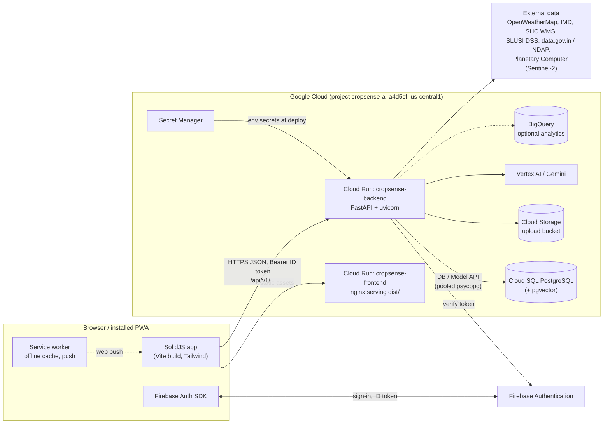
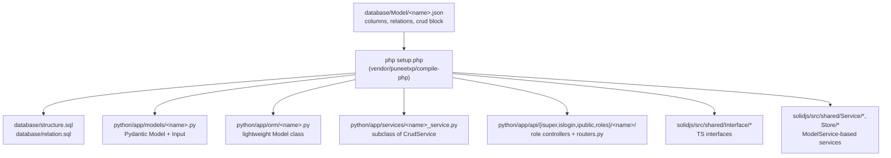
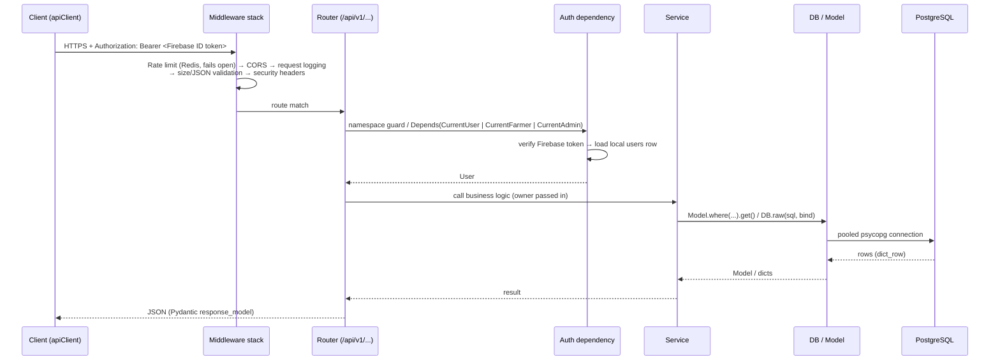
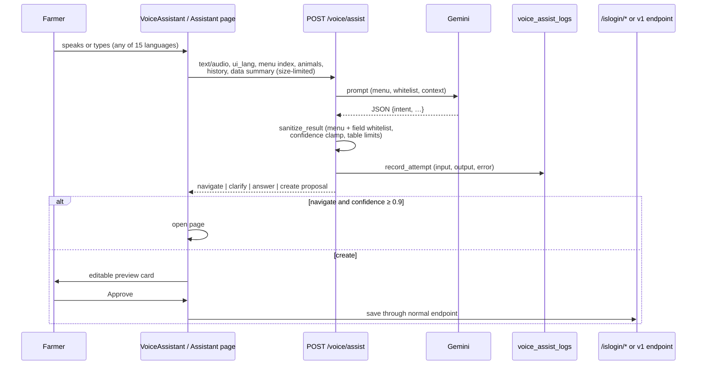

# CropSense AI — System Design

_Last updated: 2026-09-27 (branch `feat/livestock-assistant-services-i18n`, commit `5eb95ff`)._

This document explains how the whole system fits together: the parts, how a request moves through them, where data lives, how code is generated from the model JSON files, how AI is used, and how it is deployed. The frontend (routes, data contracts, page handoffs, known gaps) is in [FRONTEND.md](FRONTEND.md); §10 here is a summary.

Companion documents:

| Document | Covers |
|---|---|
| [BACKEND.md](BACKEND.md) | Every FastAPI module: core layer, all `/api/v1` routers and endpoints, services, agents, jobs |
| [FRONTEND.md](FRONTEND.md) | All 45 SolidJS routes, the data each sends and receives, page-to-page handoffs, known frontend ↔ backend gaps |
| [DATA_MODEL.md](DATA_MODEL.md) | All 58 tables, their access rules, relations and how to change the schema |
| [IMPROVEMENTS.md](IMPROVEMENTS.md) | What to improve next, in priority order (P0 security → P3 clean-up) |
| [SETUP.md](SETUP.md) | Local development and production setup |
| [../FEATURES.md](../FEATURES.md) | Feature-by-feature status table (✅ / 🟡 / 🔴) |

---

## 1. What the system does

CropSense AI is a mobile-first web app for Indian smallholder farmers and the people they trade with. It covers:

- **Farm and crop management**: farms, plots, crops (including supporting/inter-crops), expenses, growth milestones, AI annual strategy, yield and harvest readiness.
- **Livestock**: animals, health records, vaccinations, breeding and offspring, nutrition and diet plans, ROI, a vet directory and AI symptom check.
- **Soil, weather and pests**: Soil Health Card (SHC) and SLUSI soil data, soil tests, fertilizer plans, weather forecasts and severe-weather alerts, pest and disease risk.
- **Marketplace**: crop listings, buyer interest, advance (pre-harvest) bookings with payments and quality checks, livestock listings and trades, transport booking, market intelligence and price prediction.
- **AI features**: a floating voice/text assistant and a full-page chat that know the farmer's data and fill forms for approval, crop photo diagnosis, satellite field health (Sentinel-2), an analytics board with 12-month AI projections.
- **Platform**: Firebase sign-in, 15 UI languages, PWA with offline support, web push plus an in-app inbox, per-user AI quota.

User types: **farmer** (main user), **buyer**, **service_provider** (vets, transporters and other services), **admin**.

---

## 2. High-level architecture



**Two deployables:**

| Service | Built from | Runtime | Sizing (from `deploy-gcp.sh`) |
|---|---|---|---|
| `cropsense-backend` | `python/` (`python/Dockerfile`) | FastAPI on Cloud Run, port 8000, Cloud SQL via unix socket `/cloudsql/<conn>` | 2 vCPU, 2 GiB, min 1 / max 10 instances |
| `cropsense-frontend` | `solidjs/` (`solidjs/Dockerfile`) | Static `dist/` behind nginx, port 8080 | 1 vCPU, 256 MiB, min 0 / max 5 |

Backend `min-instances=1` is deliberate: the cold start is longer than the sign-in client timeout (see [IMPROVEMENTS.md #21](IMPROVEMENTS.md#p2-reliability-cost-and-operations)).

---

## 3. Repository map

```
python/                 FastAPI backend
  app/main.py           App factory: middleware, router mounting, schedulers
  app/core/             DB/Model layer, auth, ownership, middleware, config
  app/api/isuper/       GENERATED admin CRUD controllers (one folder per table)
  app/api/islogin/      GENERATED signed-in-owner CRUD controllers
  app/api/ipublic/      GENERATED public read controllers
  app/api/roles/        GENERATED custom-role controllers (service_provider)
  app/api/routers.py    GENERATED registry of all the above
  app/api/v1/           Hand-written business-logic routers (51 files)
  app/models/           GENERATED Pydantic models (<Model>, <Model>Input)
  app/orm/              GENERATED lightweight Model classes (+ user_sqlalchemy.py, legacy)
  app/services/         <table>_service.py = GENERATED (do not edit); other names = business logic
  app/agents/           Google ADK orchestrator agent + tools
  app/jobs/             APScheduler jobs (quota reset, SLUSI ingest, weekly yield)
solidjs/                SolidJS + TypeScript frontend
  src/index.tsx         Router and every route
  src/App.tsx           Shell: toasts, offline banner, bottom nav, voice assistant
  src/pages/            Route pages
  src/components/       Feature components (assistant, dashboard/board, farm, marketplace…)
  src/services/         Hand-written API services
  src/shared/           GENERATED interfaces, ModelService, stores, IndexedDB
  src/stores/           Auth, i18n, app-config (Settings), farm, marketplace, strategy
  src/i18n/             en/hi/mr/pa dictionaries + languages.json
database/
  Model/*.json          SOURCE OF TRUTH for the schema (58 models)
  structure.sql, relation.sql   GENERATED by setup.php
  migrations/           Additive, re-runnable SQL applied to Cloud SQL
vendor/puneetxp/compile-php/    The code generator used by setup.php
setup.php, config.json  Generator entry point and its settings
deploy-gcp.sh           One-command GCP deploy (auto / backend / frontend / infra / all)
terraform/gcp/          Cloud Run, Cloud SQL, IAM, VPC, BigQuery, Firestore
e2e/                    Playwright specs + an isolated sandbox (DB cropsense_e2e, :8100/:3100)
scripts/                Ops scripts (ingest_all.py, DB reset/restore, …)
skills/SKILL.md         How "the framework" generator works
```

Leftovers not used by the app: root `Resource/`, `composer.json`, `install.sh`, `realtime.sh`, root `package.json`, `cognito-only/`, AWS `terraform/*` (non-gcp) and `.github/workflows/*.disabled`.

---

## 4. Schema-first code generation ("the framework")

The schema is **declared, not hand-written**. Each table is a JSON file in `database/Model/`. Running `php setup.php` (driven by `config.json`) generates code for both ends:



**The `crud` block drives access.** Letters: `c` create, `r` read one, `u` update, `a` list all, `d` delete, `p` pagination.

```json
"crud": {
  "isuper":  ["c","r","u","a","d"],          // admin: everything, never owner-scoped
  "islogin": ["a","c","r","u","d"],          // signed-in user: only their own rows
  "public":  ["r"],                          // anyone: read
  "roles":   { "service_provider": ["c","r","u","a","d"] }  // custom role controller
}
```

**Rules the team follows** (from HANDOFF.md and earlier sessions):

1. **Additive only.** Never delete files, features or data without approval. Turn things off with a config toggle instead.
2. **Schema changes go through JSON → `setup.php`.** Run the generator in a *scratch copy* of the repo, then copy back only new files and additive diffs. Never hand-write `CREATE TABLE`, never add SQLAlchemy models, `create_all` or Alembic migrations.
3. **Never put logic in `app/services/<table>_service.py`.** The generator overwrites it. Use another name (`booking_workflow.py`, `satellite_health.py`, `crop_growth_tracker.py`…).
4. **A generated controller with custom logic** must be flagged `"<table>": true` under `config.json → table` so regeneration skips it.
5. **Plain CRUD lives in the role folders; `api/v1` only holds business logic.**
6. For production, write an additive, re-runnable migration in `database/migrations/` (`CREATE TABLE IF NOT EXISTS`, `ADD COLUMN IF NOT EXISTS`). `deploy-gcp.sh` step 6 applies them.

---

## 5. Backend request lifecycle



**Middleware** (`main.py`, outermost first as executed): rate limiter → CloudWatch monitoring (legacy AWS, usually disabled) → CORS → request logging (DEBUG/INFO) → `RequestValidationMiddleware` (10 MB body cap, JSON complexity, 10,000 chars per string, except fields named `*_base64`, which carry audio/photos) → `SecurityHeadersMiddleware`. CSRF middleware is intentionally off (stateless Bearer tokens).

**Namespace guards** are applied at mount time in `main.py`, not in the generated files, so regeneration can't drop them:

| Prefix | Guard |
|---|---|
| `/api/v1/isuper/*` | `get_current_admin` |
| `/api/v1/islogin/*` | `get_current_active_user` + row scoping via `core/ownership.py` |
| `/api/v1/service_provider/*` | `require_role(["service_provider","admin"])` |
| `/api/v1/ipublic/*` | none |
| `/api/v1/<custom>` | per router: router-level `dependencies=[...]` or typed params `CurrentUser`, `CurrentFarmer`, `CurrentAdmin`, `OptionalUser` from `core/dependencies.py` |

**Route order matters.** Generated routers mount first, then v1 routers; `users` (has a `/{user_id}` catch-all) mounts after the specific ones; `{id:int}` converters stop `/farms/{id}` shadowing `/farms/soil-lookup`.

---

## 6. Authentication and authorization

```mermaid
sequenceDiagram
  participant U as User
  participant FE as SolidJS (auth.store)
  participant FB as Firebase Auth
  participant BE as FastAPI /auth/firebase
  participant DB as users table

  U->>FE: email+password / Google / phone OTP
  FE->>FB: Firebase SDK sign-in
  FB-->>FE: Firebase ID token (1 h)
  FE->>BE: POST /api/v1/auth/google {id_token, refresh_token}<br/>(alias of /auth/firebase; ad blockers drop URLs containing "firebase")
  BE->>FB: verify token (firebase-admin)
  BE->>DB: find by uid → else link by email/phone → else create (user_type farmer)
  BE-->>FE: {access_token (= the ID token), id_token, refresh_token, expires_in, user}
  FE->>BE: GET /api/v1/auth/user
  BE-->>FE: local user profile (id, username, user_type, language_preference, …)
  Note over FE: tokens + user_data in localStorage; every later call sends<br/>Authorization: Bearer <access_token>; refreshed via POST /auth/refresh
```

- **Token check:** `core/auth.py` `FirebaseTokenValidator.verify_token` → `get_current_user_from_token` → `get_current_active_user`. `require_role([...])` checks `user_type`/roles; `get_current_admin` = `require_role(["admin"])`.
- **Row ownership:** `core/ownership.py` holds one SQL condition per table (e.g. `crops` → crops on plots on farms the user owns). `core/crud_service.py` applies it to list/read/update/delete for `/islogin/*`, and `_check_parents` stops a user from creating rows attached to someone else's farm/animal. Custom routers reuse `services/farm_access.py` for the same checks with raw SQL.
- **E2E/test mode:** with `E2E_ACTIVE`, Firebase is off and `Bearer mock-token-<email>` signs in as that seeded user (sandbox only).
- **MFA:** the UI exists; the backend MFA is still faked (see [IMPROVEMENTS.md #27](IMPROVEMENTS.md#p2-reliability-cost-and-operations)).

---

## 7. Data layer

- **Database:** PostgreSQL (Cloud SQL in prod; `cropsense_local` for dev; `cropsense_e2e` for the sandbox). pgvector is used for supply-request similarity search (`core/vector_indexes.py`, `services/vector_service.py`).
- **Access API:** the in-house `DB` query builder (`core/db.py`) and `Model` base class (`core/model.py`), modelled on the PHP framework's `DB.php`:
  - `Model.where({...}).and_where(...).get()`, `.first()`, `.find(id)`, `.create(data).get_inserted()`, `.update(data)`, `.upsert([...])`, `.with_rel([...])`, `.paginate(n, size)`
  - `DB.raw(sql, bind)` for joins and aggregates (used by the ported services)
- **Connection pool:** SQLAlchemy is used **only** as a pool under `DB.exe()` (`DB_POOL_SIZE`=2, `DB_MAX_OVERFLOW`=2 per worker, sized for Cloud SQL `db-f1-micro`). The one real SQLAlchemy model left is `orm/user_sqlalchemy.py` (legacy auth path).
- **Unknown keys are dropped** by the ORM on write. That hid a bug in plots (`is_active` vs the real `enable` column), so check column names against the JSON model.
- **File storage:** `services/file_storage.py` writes to GCS when `GCS_BUCKET` is set, else `/tmp/uploads` (lost on Cloud Run restart).
- **Caches:** Redis for rate limiting and response caching (`core/cache.py`) when available; browser-side `apiClient` in-memory cache and IndexedDB (`shared/indexdb.ts`) for offline.

---

## 8. AI architecture

| Feature | Entry point | Model / source | Safety and limits |
|---|---|---|---|
| Voice/text assistant (floating panel + `/assistant` page) | `POST /api/v1/voice/assist` → `services/voice_assist_service.py` | Gemini `GEMINI_ASSIST_MODEL` (`gemini-3.5-flash-lite`), falls back to `GEMINI_MODEL` | Output sanitised against the menu index and a whitelist of creatable records/fields; ownership ids only from the user's own lists; context ≤ 8,000 chars, tables ≤ 8 cols × 25 rows; every call audited in `voice_assist_logs` |
| Voice Q&A (audio in) | `POST /voice/query` | Gemini multimodal audio | Mock fallback when Vertex unavailable |
| Agent chat | `POST /agents/chat` → `agents/orchestrator_agent.py` | Google ADK agent with tools `get_farm_details`, `get_soil_info`, `get_weather_forecast`, `get_market_prices` | Tools act as the signed-in user (`set_agent_user`) |
| Crop photo diagnosis | `POST /vision/diagnose-crop` → `vision_diagnosis_service.py` | Gemini Vision | `agro_safety.py` removes banned actives (India, 2018 order and earlier) and model-invented doses; saved to `crop_diagnoses` |
| Satellite field health | `GET /satellite/farm/{id}`, `/satellite/my-farms` → `satellite_health.py` | Sentinel-2 L2A via Microsoft Planetary Computer (NDVI, NDMI, NDRE) | Cloud masking via SCL; re-checks at most every 5 days; stored in `satellite_observations` |
| Annual strategy | `POST /annual-strategy` | Gemini | Quota-checked |
| Crop recommendations | `/crop-recommendations` | RAG over stored data, else Gemini | `/health` currently always 503 |
| Analytics board projections | frontend `board.service.ts` + `/predictive-analytics/*` | Rules + demand signals, confidence range | Clearly labelled projections |
| Explainability wrapper | `services/explainability.py` | n/a | Adds confidence, data sources, reasoning, limitations, bias note |

**"AI proposes, human approves."** The assistant never writes to the database. It returns a `create` proposal. The frontend shows an editable preview (`ProposalCard` / `AddLivestockCard`), and on **Approve** saves through the same role-based CRUD or v1 endpoints the normal forms use.



AI usage is metered per user by `services/ai_quota_service.py` (`ai_usage_quota` table), reset at midnight IST by `jobs/quota_reset_job.py`.

---

## 9. Background work and data ingestion

| Job | Where | Schedule | What it does |
|---|---|---|---|
| Quota reset | `jobs/quota_reset_job.py` (APScheduler, started in `main.py`) | Daily 00:00 IST | Resets per-user AI usage counters |
| SLUSI ingestion | `jobs/slusi_ingestion_job.py` | Every `SLUSI_INGEST_INTERVAL_DAYS` | Scrapes SLUSI DSS land-capability reports (`dss_parser.py`) into `slusi_lcc_reports`, `slusi_microwatershed_maps`; run tracked in `slusi_ingestion_runs` |
| Weekly yield update | `jobs/weekly_yield_update.py` | Manual (`python -m app.jobs.weekly_yield_update`); not scheduled | Refreshes yield predictions from weather/soil changes |
| One-shot ingest | `scripts/ingest_all.py` | Manual | Runs every source whose key is configured (SLUSI, mandi prices, soil moisture, optional NDAP mail); tracked in `ndap_ingestion_runs` |
| SHC code seed | `services/shc_code_mapper.py` at startup | Once | Seeds `shc_state_district_codes` from soilhealth4.dac.gov.in |

Schedulers run **inside the web process**. With `max-instances=10`, each instance starts its own scheduler (see [IMPROVEMENTS.md #19](IMPROVEMENTS.md#p2-reliability-cost-and-operations)). They are off in E2E mode.

---

## 10. Frontend (summary)

Full detail is in **[FRONTEND.md](FRONTEND.md)**: all 45 routes, the request and response fields of every backend call, page-to-page handoffs and the known frontend ↔ backend gaps.

- **SolidJS + `@solidjs/router`**, every page lazy-loaded. 5 routes are public (`/`, `/auth/signin`, `/auth/signup`, `/marketplace`, `/marketplace/:id`); the other 40 are wrapped in `ProtectedRoute`, which checks sign-in only, not roles.
- **Shell (`App.tsx`)**: runs `initializeAuth()` and `initServiceWorker()`; renders toasts, offline banner, install prompt, bottom nav, desktop services button and the floating voice assistant.
- **Calling the backend**: everything goes through `lib/api-client.ts` (base `${VITE_API_URL}/api/v1`, Bearer token from `localStorage.access_token`, 30 s timeout, 3 retries, 5 min GET cache). Pages use one of three styles: registry services (`services/*.ts` + `config/api-registry.json`) for `api/v1` business logic, direct `apiClient` calls, or the generated `ModelService` (`/islogin/<table>/`) for plain CRUD.
- **State**: Solid stores in `stores/` (auth, i18n, app-config, farm, strategy, marketplace); localStorage for tokens, `user_data`, `app_lang`, `app_config`, `assistant_chat`; IndexedDB `rural_farming_db` mirrors CRUD rows; the service worker caches `/api/*` GETs.
- **Page handoffs** use only path ids, query strings (e.g. `?farmId=`), in-memory stores and localStorage; no `sessionStorage`.
- **Top open issues** (see [FRONTEND.md §5](FRONTEND.md#5-known-frontend--backend-gaps-verified-2026-09-28)): buyer dashboard calls the wrong host; bookings from matches get stuck; `/strategy/results` gets a 500; `/soil/hub` calls three missing routes; `/admin/analytics` has no admin guard; `GET /livestock/` is not owner-scoped; cached data survives sign-out.

---

## 11. Deployment and environments

| Environment | Backend | Frontend | DB | Auth |
|---|---|---|---|---|
| Local dev | `python/start_backend.sh` :8000 | `npm run dev` (Vite) | `cropsense_local` | Firebase |
| E2E sandbox | `e2e/sandbox/start-backend.sh` :8100 | :3100 | `cropsense_e2e` (reset per run) | mock tokens |
| Production | Cloud Run `cropsense-backend` | Cloud Run `cropsense-frontend` | Cloud SQL | Firebase |

`deploy-gcp.sh` modes: `auto` (default: rebuild only what changed since the running image's commit), `backend`, `frontend`, `app`, `infra`, `all`. Steps: gcloud checks → APIs → Artifact Registry → secrets → Terraform → **DB migrations (idempotent, one connection, with retries via cloud-sql-proxy)** → Firebase config → Cloud Build + deploy backend → build + deploy frontend and update CORS/sign-in domains/SMS regions → health check. Images are tagged with the git commit (`-dirty-<ts>` if uncommitted).

Secrets (Secret Manager → env): `POSTGRES_PASSWORD`, `SECRET_KEY`, `OPENWEATHER_API_KEY`, `VAPID_PUBLIC_KEY`, `VAPID_PRIVATE_KEY`. Production deploys need an explicit OK from the project owner.

CI (`.github/workflows/`): `backend-ci.yml` (lint, tests with the schema from `setup.php`, security, build), `frontend-ci.yml` (lint, build, Lighthouse), `deploy-production-gcp.yml`, `scheduled-tests.yml`.

---

## 12. Observability

- **Health:** `/health`, `/health/live`, `/health/ready`, `/health/detailed`, `/health/database`, `/health/redis`, `/health/bedrock` (root level, no `/api/v1`).
- **Logs:** Cloud Run logs (`gcloud run services logs read cropsense-backend …`). Request logging middleware at DEBUG/INFO.
- **Audit tables:** `voice_assist_logs` (every assistant call, including failures), `slusi_ingestion_runs`, `ndap_ingestion_runs`, `crop_diagnoses`.
- **Principle:** when something misbehaves, find the cause in logs or the stored record first, and leave logging behind that shows it next time. The voice bug (JSON string cap of 10,000 chars) was only visible from the response body, which is why `voice_assist_logs` exists.
- Legacy CloudWatch/SNS alerting code (`core/monitoring.py`, `core/alerting.py`) is AWS-only and not wired to GCP.
