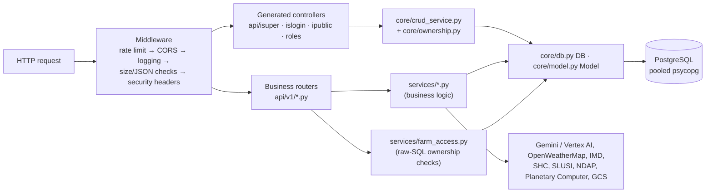

# CropSense AI — Backend

_Last updated: 2026-09-28 (branch `feat/livestock-assistant-services-i18n`)._

How the FastAPI backend (`python/app/`) is organised: the core layer, the generated CRUD controllers, the 51 hand-written `api/v1` routers (394 endpoints), the business services, the AI agent, and the scheduled jobs. For the whole-system picture see [ARCHITECTURE.md](ARCHITECTURE.md); for which frontend page calls which endpoint see [FRONTEND.md](FRONTEND.md); for the tables see [DATA_MODEL.md](DATA_MODEL.md).

| Section | Covers |
|---|---|
| [1. Layers](#1-layers) | How a request moves through the code |
| [2. App startup](#2-app-startup-mainpy) | Middleware, router mounting, schedulers |
| [3. Core layer](#3-core-layer-core) | DB, ORM, auth, ownership, config |
| [4. Generated CRUD controllers](#4-generated-crud-controllers) | `/isuper`, `/islogin`, `/ipublic`, `/service_provider` |
| [5. Business routers](#5-business-routers-apiv1) | All 51 `api/v1` routers at a glance |
| [6. Business services](#6-business-services-services) | Where the logic lives, grouped by feature |
| [7. AI agent and jobs](#7-ai-agent-and-scheduled-jobs) | ADK agent, APScheduler jobs |
| [8. Open endpoints and auth notes](#8-endpoints-without-sign-in) | Which endpoints need no sign-in, and which of those write |
| [Appendix: every endpoint](#appendix-every-endpoint) | Method, path, handler, line and guard for all 394 |

All paths below are under `/api/v1` unless noted.

---

## 1. Layers

| Layer | Folder | Written by | Rule |
|---|---|---|---|
| Pydantic models | `app/models/<table>.py` | Generator (`php setup.php`) | Never edit by hand |
| ORM classes | `app/orm/<table>.py` | Generator | Never edit by hand (except `orm/user_sqlalchemy.py`, legacy) |
| Table services | `app/services/<table>_service.py` | Generator | Subclass of `CrudService`; **never put logic here** (overwritten) |
| Role controllers | `app/api/{isuper,islogin,ipublic,roles}/<table>/` | Generator | Plain CRUD only. Flag a customised one `true` under `config.json → table` |
| Business routers | `app/api/v1/*.py` | Hand-written | Business logic only; plain CRUD belongs in the role folders |
| Business services | `app/services/<other name>.py` | Hand-written | e.g. `booking_workflow.py`, `satellite_health.py` |

---

## 2. App startup (`main.py`)

1. **Settings** come from `core/config.py` (env vars; Secret Manager in prod).
2. **Middleware** is added in this order (outermost runs first):
   - Rate limiter (`core/rate_limiter.py`, Redis; fails open when Redis is down)
   - CloudWatch monitoring (legacy AWS, normally off)
   - CORS
   - Request logging (DEBUG/INFO)
   - `RequestValidationMiddleware` (`core/security_middleware.py`): 10 MB body cap, JSON complexity limits, 10,000 chars per string except fields named `*_base64`
   - `SecurityHeadersMiddleware`
   - CSRF middleware is intentionally off (stateless Bearer tokens).
3. **Generated routers** (`api/routers.py` → `all_routers`) are mounted first under `/api/v1`, each with a guard chosen by prefix:

   | Prefix | Guard |
   |---|---|
   | `/isuper` | `get_current_admin` |
   | `/islogin` | `get_current_active_user` |
   | `/service_provider` | `require_role(["service_provider","admin"])` |
   | `/ipublic` | none |

   The guard is applied here rather than in the generated files, so regeneration can't drop it.
4. **Business routers** are mounted next, in a fixed order: `users` (which has a `/{user_id}` catch-all) comes after the specific routes. Two routers get an extra prefix:
   - `advance_booking` → `/api/v1/marketplace/advance-bookings/*`
   - `upload` → `/api/v1/upload/*`
5. **Health router** is mounted at the root (`/health*`, no `/api/v1`).
6. **On startup** (`startup_event`), in order:
   1. Redis cache manager
   2. Rate limiter connects to Redis
   3. Quota-reset and SLUSI schedulers
   4. SHC state/district code seed
   5. Database connection check

   Steps 3 and 4 are skipped in E2E mode.

---

## 3. Core layer (`core/`)

| Module | What it does |
|---|---|
| `config.py` | `Settings` (env): DB, Redis, Firebase, Gemini models (`GEMINI_MODEL`, `GEMINI_ASSIST_MODEL`), GCS bucket, rate limits, scheduler intervals, `E2E_ACTIVE` |
| `db.py` | `DB` query builder (port of the PHP framework's `DB.php`): `DB.raw(sql, bind)`, `.exe()`, `.result`, `.rows`. SQLAlchemy is used **only** as the connection pool under it (`DB_POOL_SIZE`=2, `DB_MAX_OVERFLOW`=2 per worker) |
| `model.py` | `Model` base: `where().and_where().get()`, `first()`, `find(id)`, `create(data).get_inserted()`, `update()`, `upsert([...])`, `with_rel([...])`, `paginate(n, size)`. Unknown keys are dropped on write |
| `database.py` | Session/engine setup, `get_db` dependency (the async session some older routers still use) |
| `crud_service.py` | `CrudService`, the base of every generated `<table>_service.py`: `all`, `find`, `where`, `create`, `update`, `upsert`, `delete`. With `owner` passed (the `/islogin` controllers), it applies `ownership.py` |
| `ownership.py` | `OWNERSHIP` (one SQL rule per table), `SHARED_READ` (`veterinarians`, `services`), `OWNER_COLUMNS` (forced to the caller on create), `PARENTS` (parent ids that must be owned). See [DATA_MODEL.md §3](DATA_MODEL.md#3-who-can-see-and-change-what) |
| `auth.py` | `FirebaseTokenValidator.verify_token` → `get_current_user_from_token` → `get_current_active_user`; `require_role([...])`; `get_current_admin`. In E2E mode, `Bearer mock-token-<email>` signs in as a seeded user |
| `dependencies.py` | Typed shortcuts used in handler signatures: `CurrentUser`, `CurrentFarmer`, `CurrentAdmin`, `OptionalUser`, `DB`, `AuthCredentials` |
| `rate_limiter.py` | Redis sliding window; separate public limit; fails open |
| `security_middleware.py`, `validation.py` | Request size/JSON validation, security headers, input sanitisers |
| `cache.py` | Redis response cache helpers (used when Redis is present) |
| `vector_indexes.py` | pgvector index setup for supply-request similarity search |
| `password.py`, `encryption.py` | bcrypt hashing; at-rest encryption helpers |
| `model_router.py`, `model_service.py` | Hybrid-AI routing between local models and Gemini (used by `hybrid_ai`) |
| `query_optimizer.py`, `tls_config.py` | Query helpers; TLS settings for non-Cloud-Run deployments |
| `monitoring.py`, `monitoring_middleware.py`, `alerting.py` | Legacy CloudWatch/SNS (AWS only; not wired to GCP) |
| `init_db.py` | Old sample-data loader (the schema itself comes from `database/structure.sql`) |

---

## 4. Generated CRUD controllers

| Folder | Mounted at | Controllers | Who | Scoping |
|---|---|---|---|---|
| `api/isuper/` | `/isuper/<table>/` | 57 | admin | None; every row |
| `api/islogin/` | `/islogin/<table>/` | 52 | any signed-in user | `ownership.py` rule per table; tables without a rule are read-only reference data |
| `api/ipublic/` | `/ipublic/<table>/` | 15 | anyone | None; read-only |
| `api/roles/service_provider/` | `/service_provider/service/` | 1 (`service`) | service_provider, admin | Owner-only writes |

Every controller is the same short file (see `api/islogin/crop/crop.py`):

| Method | Path | Calls |
|---|---|---|
| `GET` | `/` | `service.all(owner)`: every visible row, `ORDER BY id DESC`, **no pagination** |
| `GET` | `/{id}` | `service.find(id, owner)`, 404 if not visible |
| `POST` | `/` | `service.create(payload, owner)`: owner columns forced, parents checked, returns the row (201) |
| `PUT` | `/{id}` | `service.update(...)`: owner columns can't be changed |
| `DELETE` | `/{id}` | `service.delete(...)` → `{"success": true}` |

Which letters (`c r u a d p`) each role gets comes from the model JSON `crud` block. See [DATA_MODEL.md §2](DATA_MODEL.md#2-all-tables).

Controllers flagged `true` under `config.json → table` are skipped on regeneration because they were customised: `active_role`, `buyer_interest`, `farm`, `livestock`, `marketplace_listing`, `role`, `user`, `ai_usage_quota`, `veterinarian`, `push_subscription`.

---

## 5. Business routers (`api/v1/`)

**Auth** (from the handler signatures and router dependencies):

| Label | Meaning |
|---|---|
| user | any signed-in user |
| farmer | `CurrentFarmer` |
| admin | `CurrentAdmin` / `get_current_admin` |
| owner | router-level owner check |
| none | no sign-in required |

The per-endpoint list is in the [Appendix](#appendix-every-endpoint).

### Account and platform

| Router | Prefix | # | Auth | Purpose |
|---|---|---|---|---|
| `auth.py` | `/auth` | 16 | none (checks the token itself where needed) | Firebase sign-in (`/firebase`, alias `/google`), `/user`, `/refresh`, `/refresh-token`, `/logout`; legacy signup/signin/MFA/password-reset |
| `users.py` | `/users` | 10 | user | Profile get/update, change password, MFA toggle, admin user lookup (`/{user_id}` catch-all; mounted late) |
| `ai_quota.py` | `/ai-quota` | 6 | user 3, admin 3 | Per-user AI quota status/check/increment; admin reset, limits, statistics |
| `notifications.py` | `/notifications` | 8 | user 6, admin 1, none 1 | VAPID key (public), push subscribe/unsubscribe/test, in-app inbox, read/read-all |
| `upload.py` | `/upload` | 4 | user 3, none 1 | Image upload to GCS (or `/tmp/uploads`); public `GET /upload/files/{filename}` |
| `address.py` | `/address` | 4 | none | Pincode lookup, address auto-fill/validate, distance |
| `health.py` | `/health` (root) | 7 | none | Liveness, readiness, DB, Redis, detailed; `/health/bedrock` is legacy |

### Farms, crops and planning

| Router | Prefix | # | Auth | Purpose |
|---|---|---|---|---|
| `farms.py` | `/farms` | 10 | farmer 7, user 3 | Farm CRUD with inline plots, `location-lookup`, `soil-lookup`, `/farms/{id:int}/plots` |
| `crops.py` | `/crops` | 9 | farmer 7, user 2 | `quick-plant` (with supporting crops), `my-crops`, expenses, crop lifecycle |
| `crop_milestones.py` | `/crop-milestones` | 8 | user 7, admin 1 | Growth stages from `crop_growth_tracker.py` |
| `annual_strategy.py` | `/annual-strategy` | 6 | user | Gemini annual plan (kharif/rabi/zaid), save, list, get, status, feedback |
| `crop_recommendations.py` | `/crop-recommendations` | 4 | none | RAG recommendations; `/health` always returns 503 |
| `plot_analysis.py` | `/plot-analysis` | 5 | user | Plot suitability and profitability analysis |
| `plot_publishing.py` | `/plot-publishing` | 4 | user | Publish a plot's expected harvest as listings |
| `yield_predictions.py` | `/yield-predictions` | 4 | farmer 3, none 1 | Yield/profit prediction; `PUT /{id}` is an unauthenticated stub |
| `analytics.py` | `/analytics` | 10 | user 8, admin 2 | `profile-status` (dashboard data), farm analytics, performance, platform/executive reports (admin) |
| `community_dashboard.py` | `/community` | 1 | none | Aggregated community dashboard |

### Soil, weather, pests

| Router | Prefix | # | Auth | Purpose |
|---|---|---|---|---|
| `soil.py` | `/soil` | 10 | farmer 8, none 2 | Soil health per plot (`/soil/health/plot/{id}`), recommendations, moisture |
| `soil_health.py` | `/soil-health` | 8 | user | Soil health tracking and reports |
| `soil_testing.py` | `/soil-testing` | 10 | user | Lab tests, PDF upload (`/upload-pdf`), results |
| `soil_maps.py` | `/soil-maps` | 7 | user | NBSS/SHC maps: GPS, district, auto-populate, similar farms, peer comparison |
| `slusi.py` | `/slusi`, `/farms/soil-lookup/v2` | 7 | none 3, user 2, admin 2 | SLUSI LCC and microwatershed data, ingestion status/trigger |
| `fertilizer_recommendations.py` | `/fertilizer-recommendations` | 7 | user | NPK and fertilizer plans |
| `fertilizer_tracking.py` | `/fertilizer-tracking` | 7 | user | Applications and their effect |
| `weather.py` | `/weather` | 4 | none | Current, forecast, alerts, seasonal analysis (OpenWeatherMap with IMD failover) |
| `severe_weather.py` | `/severe-weather` | 6 | user | Active alerts per farm, monitoring |
| `weather_recommendations.py` | `/weather-recommendations` | 5 | user | Weather-driven farm advice |
| `pest_disease.py` | `/pest-disease` | 13 | user | Identify, treatments, alerts, regional risk |
| `vision_diagnosis.py` | `/vision` | 4 | user | Gemini Vision crop diagnosis (`/diagnose-crop`), history (`/diagnoses`) |
| `satellite.py` | `/satellite` | 2 | user | Sentinel-2 NDVI/NDMI/NDRE per farm, `my-farms` |

### Livestock

| Router | Prefix | # | Auth | Purpose |
|---|---|---|---|---|
| `livestock.py` | `/livestock` | 8 | user 7, farmer 1 | Animals, portfolio, ROI. **`GET /` and `/farmer/{id}/portfolio` do not check that `farmer_id` is the caller** |
| `livestock_health.py` | `/livestock-health` | 11 | owner | Health records, vaccination schedule, reports (router-level `enforce_livestock_owner`) |
| `livestock_nutrition.py` | `/livestock-nutrition` | 7 | user | Diet plans and feed advice |
| `livestock_breeding.py` | `/livestock-breeding` | 12 | user | Breeding records, offspring, pregnancy tracking |
| `livestock_transactions.py` | `/livestock-transactions` | 12 | user | Purchases and sales |
| `livestock_listings.py` | `/livestock-listings` | 10 | user 6, none 4 | Catalog listings; public list/detail; public interest/inquiry counters |
| `livestock_marketplace.py` | `/livestock-marketplace` | 7 | user 4, none 3 | Marketplace listings (public browse), ROI calculation/report |
| `vaccination_reminders.py` | `/vaccination-reminders` | 7 | user | Due vaccinations and reminders |
| `veterinary.py` | `/veterinary` | 10 | user 7, none 3 | Doctor directory (public read), symptom check, remote diagnosis, save diagnosis |

### Marketplace, supply and transport

| Router | Prefix | # | Auth | Purpose |
|---|---|---|---|---|
| `marketplace.py` | `/marketplace` | 7 | user 3, none 3, farmer 1 | Listings (public browse/search/detail), my-listings, buyer interest, create from a crop |
| `advance_booking.py` | `/marketplace/advance-bookings` | 10 | user | Pre-harvest bookings: create, confirm, cancel, complete, quality-verify, dispute, payments (state machine in `services/booking_workflow.py`) |
| `supply_requests.py` | `/supply-requests` | 7 | user | Buyer supply requests, matching (single farmer or aggregated), accept-match, refresh |
| `transport.py` | `/transport` | 15 | user | Providers, cost estimate, bookings, tracking, reviews |
| `market_data.py` | `/market-data` | 18 | **none** | Price/yield/profitability ingestion and reads. **The write endpoints are open**, see §8 |
| `market_intelligence.py` | `/market-intelligence` | 12 | none 9, admin 3 | Trends, price history, quality premiums, demand forecast, MSP, summary |
| `predictive_analytics.py` | `/predictive-analytics` | 6 | user | Price and demand prediction, opportunity score, supply-demand gaps, buyer supply planning |

### AI and model infrastructure

| Router | Prefix | # | Auth | Purpose |
|---|---|---|---|---|
| `voice_agent.py` | `/voice` | 2 | user | `/voice/assist` (text/audio assistant, logged in `voice_assist_logs`), `/voice/query` (multipart audio Q&A) |
| `agents.py` | `/agents` | 1 | user | `/agents/chat` → ADK orchestrator agent |
| `hybrid_ai.py` | `/hybrid-ai` | 8 | admin | Routing between local models and Gemini |
| `model_training.py` | `/model-training` | 4 | admin | Custom yield-model training |
| `sagemaker.py` | `/sagemaker` | 14 | admin | Legacy AWS SageMaker wrapper (now a compatibility shim) |

---

## 6. Business services (`services/`)

These are the hand-written services, where the logic lives. The generated `<table>_service.py` files are not listed. Files marked _legacy_ are AWS-era and kept for compatibility.

| Area | Services |
|---|---|
| Access helpers | `farm_access.py` (raw-SQL ownership checks for custom routers), `livestock_repository.py` |
| Farms and crops | `crop_growth_tracker.py` (growth stages → `crop_milestones`), `yield_profit_service.py`, `yield_prediction_update_service.py`, `profit_margin_service.py`, `plot_analysis_service.py`, `plot_publishing_service.py`, `analytics_service.py` |
| AI | `voice_assist_service.py` (prompt, `sanitize_result`, keyword fallback), `voice_assist_audit.py` (`record_attempt`), `vision_diagnosis_service.py`, `agro_safety.py` (removes banned actives and invented doses), `explainability.py`, `crop_recommendation_service.py` (RAG), `hybrid_ai_service.py`, `model_training_service.py`, `vector_service.py` (pgvector), `bedrock_service.py` _legacy_, `sagemaker_service.py` _legacy_ |
| Satellite | `satellite_health.py` (Planetary Computer STAC, SCL cloud mask, 5-day re-check) |
| Soil | `slusi_service.py`, `dss_parser.py`, `shc_fetcher.py`, `shc_code_mapper.py`, `nbss_service.py`, `soil_mapping.py`, `soil_testing_service.py`, `soil_health_report_service.py`, `fertilizer_recommendation_service.py`, `fertilizer_tracking_service.py` |
| Weather and pests | `weather_service.py` (failover), `openweathermap_service.py`, `imd_service.py`, `severe_weather_service.py`, `weather_recommendations_service.py`, `pest_disease_service.py` |
| Livestock | `livestock_health_service.py`, `livestock_nutrition_service.py`, `livestock_breeding_service.py`, `livestock_roi_service.py`, `vaccination_reminder_service.py`, `veterinary_service.py`, `veterinarian_directory_service.py`, `livestock_listing_catalog.py`, `livestock_trade_workflow.py`, `transport_service.py` |
| Marketplace | `marketplace_service.py`, `booking_workflow.py` (advance-booking state machine), `booking_reminder_service.py`, `supply_request_matching_service.py`, `market_data_service.py`, `price_tracking_service.py`, `predictive_analytics_service.py`, `seasonal_trend_analysis.py` |
| Location | `address_service.py`, `pincode_lookup_service.py` |
| Platform | `ai_quota_service.py`, `file_storage.py` (GCS or `/tmp/uploads`), `notification_inbox.py`, `web_push_service.py`, `bigquery_service.py` (optional), `firestore_service.py`, `notification_service.py` _legacy SNS_, `cognito_service.py` _legacy_ |

---

## 7. AI agent and scheduled jobs

**Agent** (`agents/`):
- `orchestrator_agent.py` is a Google ADK root agent, called by `POST /agents/chat`.
- `agent_tools.py` provides its tools: `get_farm_details`, `get_soil_info`, `get_weather_forecast` and `get_market_prices`.
- The tools act as the signed-in user, set through `set_agent_user`.

**Jobs** (`jobs/`):

| Job | How it runs | Does |
|---|---|---|
| `quota_reset_job.py` | APScheduler in the web process, daily 00:00 IST | Resets `ai_usage_quota` counters |
| `slusi_ingestion_job.py` | APScheduler in the web process, every `SLUSI_INGEST_INTERVAL_DAYS` | Scrapes SLUSI DSS into `slusi_lcc_reports` / `slusi_microwatershed_maps`, logs `slusi_ingestion_runs` |
| `weekly_yield_update.py` | **Not scheduled**; run by hand with `python -m app.jobs.weekly_yield_update` | Refreshes yield predictions |

The two scheduled jobs are off in E2E mode. Each Cloud Run instance starts its own scheduler, so with up to 10 instances a job can run up to 10 times. See [IMPROVEMENTS.md](IMPROVEMENTS.md).

---

## 8. Endpoints without sign-in

Most are meant to be public: auth, health, address, public marketplace/livestock browse, weather, market intelligence reads, SLUSI reads and the vet directory.

These, however, **change data with no sign-in**:

| Endpoint | Effect |
|---|---|
| `POST /market-data/crop-prices`, `/crop-prices/bulk`, `/historical-yields`, `/crop-profitability`, `/seasonal-trends/store`, `/opportunity-cost/save` | Anyone can insert market reference data that feeds price prediction and strategy |
| `POST /livestock-listings/{id}/interest`, `/{id}/inquiry` | Anyone can inflate listing counters |
| `PUT /yield-predictions/{id}` | Stub that changes nothing, but it is open |

Two more to know:
- `GET /livestock/` and `GET /livestock/farmer/{id}/portfolio` need sign-in but don't check that `farmer_id` belongs to the caller.
- `/auth/user` and `/auth/logout` read the Bearer token themselves; they show as "none" in the appendix for that reason.

---

## Appendix: every endpoint

Generated from the router source (`@router.<method>` decorators, `APIRouter(prefix=…, dependencies=…)` and handler signatures) on 2026-09-28. "L" is the line number of the handler in the router file. Regenerate after changing routers.

`address.py` — Address Management API Endpoints (4)

| Method | Path | Handler | Auth |
|---|---|---|---|
| POST | `/address/auto-fill` | `auto_fill_address` (L27) | **none** |
| POST | `/address/validate` | `validate_address` (L50) | **none** |
| GET | `/address/pincode/{pincode}` | `lookup_pincode` (L73) | **none** |
| POST | `/address/distance` | `calculate_distance` (L99) | **none** |

`advance_booking.py` — Advance Booking API endpoints for pre-harvest booking system (10)

| Method | Path | Handler | Auth |
|---|---|---|---|
| POST | `/marketplace/advance-bookings` | `create_advance_booking` (L111) | user |
| GET | `/marketplace/advance-bookings` | `list_bookings` (L133) | user |
| GET | `/marketplace/advance-bookings/{id}` | `get_booking` (L142) | user |
| PUT | `/marketplace/advance-bookings/{id}` | `update_booking_status` (L148) | user |
| POST | `/marketplace/advance-bookings/{id}/confirm` | `confirm_booking` (L161) | user |
| POST | `/marketplace/advance-bookings/{id}/cancel` | `cancel_booking` (L171) | user |
| POST | `/marketplace/advance-bookings/{id}/complete` | `complete_booking` (L181) | user |
| POST | `/marketplace/advance-bookings/{id}/quality-verify` | `quality_verify` (L187) | user |
| POST | `/marketplace/advance-bookings/{id}/dispute` | `raise_dispute` (L207) | user |
| POST | `/marketplace/advance-bookings/{id}/payments` | `record_payment` (L221) | user |

`agents.py` — API endpoints for Google Antigravity Agent orchestration. (1)

| Method | Path | Handler | Auth |
|---|---|---|---|
| POST | `/agents/chat` | `chat_with_agent` (L27) | user |

`ai_quota.py` — AI Usage Quota API Endpoints (6)

| Method | Path | Handler | Auth |
|---|---|---|---|
| GET | `/ai-quota/status/{user_id}` | `get_quota_status` (L41) | user |
| POST | `/ai-quota/check` | `check_quota` (L70) | user |
| POST | `/ai-quota/increment` | `increment_usage` (L98) | user |
| POST | `/ai-quota/reset` | `reset_daily_quota` (L125) | admin |
| PUT | `/ai-quota/limit/{user_id}` | `update_quota_limit` (L150) | admin |
| GET | `/ai-quota/statistics` | `get_usage_statistics` (L184) | admin |

`analytics.py` — Analytics API endpoints (10)

| Method | Path | Handler | Auth |
|---|---|---|---|
| GET | `/analytics/profile-status` | `get_profile_status` (L51) | user |
| GET | `/analytics/dashboard` | `get_dashboard_analytics` (L240) | user |
| GET | `/analytics/farm-performance` | `get_farm_performance` (L268) | user |
| GET | `/analytics/crop-performance` | `get_crop_performance` (L284) | user |
| GET | `/analytics/market-trends` | `get_market_trends_api` (L304) | user |
| GET | `/analytics/farmer/{farmer_id}` | `get_farmer_analytics` (L317) | user |
| GET | `/analytics/farm/{farm_id}` | `get_farm_analytics_api` (L345) | user |
| GET | `/analytics/platform` | `get_platform_analytics` (L373) | admin |
| GET | `/analytics/market` | `get_market_analytics` (L400) | user |
| GET | `/analytics/executive-report` | `get_executive_report` (L424) | admin |

`annual_strategy.py` — Annual Crop Strategy API endpoints (6)

| Method | Path | Handler | Auth |
|---|---|---|---|
| POST | `/annual-strategy` | `generate_annual_strategy` (L182) | user |
| POST | `/annual-strategy/save` | `save_annual_strategy` (L452) | user |
| GET | `/annual-strategy/list` | `list_strategies` (L512) | user |
| GET | `/annual-strategy/{id}` | `get_strategy` (L568) | user |
| PUT | `/annual-strategy/{id}/status` | `update_status` (L628) | user |
| POST | `/annual-strategy/{id}/feedback` | `add_feedback` (L654) | user |

`auth.py` — Authentication API endpoints (16)

| Method | Path | Handler | Auth |
|---|---|---|---|
| POST | `/auth/signup` | `sign_up` (L56) | **none** |
| POST | `/auth/confirm-signup` | `confirm_sign_up` (L207) | **none** |
| POST | `/auth/verify-email` | `verify_email` (L250) | **none** |
| POST | `/auth/resend-code` | `resend_confirmation_code` (L259) | **none** |
| POST | `/auth/resend-verification` | `resend_verification` (L279) | **none** |
| POST | `/auth/signin` | `sign_in` (L288) | **none** |
| POST | `/auth/firebase` | `firebase_sign_in` (L380) | **none** |
| POST | `/auth/google` | `firebase_sign_in` (L380) | **none** |
| POST | `/auth/verify-mfa` | `verify_mfa` (L455) | **none** |
| POST | `/auth/refresh` | `refresh_token` (L499) | **none** |
| POST | `/auth/refresh-token` | `refresh_token_alias` (L543) | **none** |
| POST | `/auth/forgot-password` | `forgot_password` (L556) | **none** |
| POST | `/auth/confirm-forgot-password` | `confirm_forgot_password` (L595) | **none** |
| POST | `/auth/reset-password` | `reset_password` (L638) | **none** |
| GET | `/auth/user` | `get_current_user` (L652) | **none** |
| POST | `/auth/logout` | `logout` (L702) | **none** |

`community_dashboard.py` — Community Decision Intelligence Dashboard API (1)

| Method | Path | Handler | Auth |
|---|---|---|---|
| GET | `/community/dashboard` | `get_community_dashboard` (L22) | **none** |

`crop_milestones.py` — Crop Milestone Tracking API Endpoints (8)

| Method | Path | Handler | Auth |
|---|---|---|---|
| POST | `/crop-milestones` | `create_milestones` (L86) | user |
| PUT | `/crop-milestones/{id}` | `update_milestone_progress` (L124) | user |
| POST | `/crop-milestones/{id}/complete` | `complete_milestone_alias` (L162) | user |
| GET | `/crop-milestones/{crop_id}/current-stage` | `get_current_stage` (L172) | user |
| GET | `/crop-milestones/{crop_id}/recommendations` | `get_milestone_recommendations` (L204) | user |
| POST | `/crop-milestones/send-stage-alert` | `send_stage_transition_alert` (L238) | user |
| GET | `/crop-milestones/{id}` | `get_progress_dashboard` (L292) | user |
| POST | `/crop-milestones/update-stages` | `check_and_update_stages` (L321) | admin |

`crop_recommendations.py` — RAG-Based Crop Recommendation API (4)

| Method | Path | Handler | Auth |
|---|---|---|---|
| GET | `/crop-recommendations` | `get_crop_recommendations` (L136) | **none** |
| GET | `/crop-recommendations/quick` | `get_quick_crop_recommendations` (L204) | **none** |
| GET | `/crop-recommendations/by-season/{season}` | `get_season_specific_recommendations` (L265) | **none** |
| GET | `/crop-recommendations/health` | `health_check` (L311) | **none** |

`crops.py` — Crop Recommendation API endpoints (9)

| Method | Path | Handler | Auth |
|---|---|---|---|
| POST | `/crops/{crop_id}/expenses` | `add_crop_expense` (L49) | farmer |
| GET | `/crops/{crop_id}/expenses` | `get_crop_expenses` (L108) | farmer |
| POST | `/crops/recommendations` | `get_crop_recommendations` (L278) | farmer |
| POST | `/crops/yield-prediction` | `predict_yield` (L355) | farmer |
| POST | `/crops/quick-plant` | `quick_plant` (L483) | user |
| POST | `/crops/yield-prediction/update/{crop_id}` | `update_yield_prediction` (L633) | farmer |
| GET | `/crops/harvest-readiness/{crop_id}` | `check_harvest_readiness` (L692) | farmer |
| POST | `/crops/harvest-alert/{crop_id}` | `send_harvest_readiness_alert` (L730) | farmer |
| GET | `/crops/my-crops` | `get_my_crops` (L771) | user |

`farms.py` — Farm Management API endpoints (10)

| Method | Path | Handler | Auth |
|---|---|---|---|
| GET | `/farms/location-lookup` | `lookup_farm_location` (L40) | user |
| POST | `/farms` | `create_farm` (L104) | farmer |
| GET | `/farms` | `get_my_farms` (L436) | farmer |
| GET | `/farms/{id:int}` | `get_farm` (L499) | user |
| PUT | `/farms/{id:int}` | `update_farm` (L591) | farmer |
| DELETE | `/farms/{id:int}` | `delete_farm` (L693) | farmer |
| POST | `/farms/{id}/plots` | `create_plot` (L733) | farmer |
| GET | `/farms/{id}/plots` | `get_farm_plots` (L825) | user |
| PUT | `/farms/{farm_id}/plots/{id}` | `update_plot` (L886) | farmer |
| DELETE | `/farms/{farm_id}/plots/{id}` | `delete_plot` (L957) | farmer |

`fertilizer_recommendations.py` — Fertilizer Recommendation API endpoints (7)

| Method | Path | Handler | Auth |
|---|---|---|---|
| GET | `/fertilizer-recommendations` | `get_fertilizer_recommendations_root` (L84) | user |
| POST | `/fertilizer-recommendations/complete-plan` | `generate_complete_fertilizer_plan` (L94) | user |
| POST | `/fertilizer-recommendations/nutrient-requirements` | `calculate_nutrient_requirements` (L181) | user |
| GET | `/fertilizer-recommendations/fertilizer-types` | `get_fertilizer_types` (L221) | user |
| GET | `/fertilizer-recommendations/crop-requirements` | `get_crop_nutrient_requirements` (L252) | user |
| POST | `/fertilizer-recommendations/optimize-budget` | `optimize_fertilizer_for_budget` (L279) | user |
| GET | `/fertilizer-recommendations/farm/{farm_id}/recommendations` | `get_farm_fertilizer_recommendations` (L332) | user |

`fertilizer_tracking.py` — Fertilizer Tracking API Endpoints (7)

| Method | Path | Handler | Auth |
|---|---|---|---|
| GET | `/fertilizer-tracking` | `get_fertilizer_tracking_root` (L117) | user |
| POST | `/fertilizer-tracking/applications` | `record_fertilizer_application` (L127) | user |
| PUT | `/fertilizer-tracking/applications/{application_id}/soil-response` | `update_soil_response` (L182) | user |
| GET | `/fertilizer-tracking/applications` | `get_application_history` (L218) | user |
| GET | `/fertilizer-tracking/history/{plot_id}` | `get_fertilizer_history_alias` (L258) | user |
| GET | `/fertilizer-tracking/effectiveness-analysis` | `analyze_fertilizer_effectiveness` (L277) | user |
| GET | `/fertilizer-tracking/usage-report` | `generate_usage_report` (L314) | user |

`health.py` — Health Check Endpoints for Load Balancer (7)

| Method | Path | Handler | Auth |
|---|---|---|---|
| GET | `/health` | `health_check` (L34) | **none** |
| GET | `/health/live` | `liveness_check` (L59) | **none** |
| GET | `/health/ready` | `readiness_check` (L71) | **none** |
| GET | `/health/detailed` | `detailed_health_check` (L147) | **none** |
| GET | `/health/database` | `database_health_check` (L200) | **none** |
| GET | `/health/redis` | `redis_health_check` (L227) | **none** |
| GET | `/health/bedrock` | `bedrock_health_check` (L250) | **none** |

`hybrid_ai.py` — Hybrid AI API Endpoints (8)

| Method | Path | Handler | Auth |
|---|---|---|---|
| POST | `/hybrid-ai/predict-yield` | `predict_yield` (L109) | admin |
| POST | `/hybrid-ai/annual-strategy` | `get_annual_strategy` (L153) | admin |
| GET | `/hybrid-ai/crop-recommendations` | `get_crop_recommendations` (L186) | admin |
| POST | `/hybrid-ai/batch-predict` | `batch_predict_yields` (L224) | admin |
| GET | `/hybrid-ai/cost-report` | `get_cost_report` (L258) | admin |
| GET | `/hybrid-ai/performance-report` | `get_performance_report` (L279) | admin |
| GET | `/hybrid-ai/routing-statistics` | `get_routing_statistics` (L303) | admin |
| GET | `/hybrid-ai/health` | `health_check` (L322) | admin |

`livestock.py` — Livestock Management API Endpoints (8)

| Method | Path | Handler | Auth |
|---|---|---|---|
| POST | `/livestock` | `create_livestock` (L36) | farmer |
| GET | `/livestock/{id}` | `get_livestock` (L92) | user |
| GET | `/livestock/` | `list_livestock` (L143) | user |
| PUT | `/livestock/{id}` | `update_livestock` (L185) | user |
| DELETE | `/livestock/{id}` | `delete_livestock` (L252) | user |
| GET | `/livestock/farmer/{farmer_id}/portfolio` | `get_livestock_portfolio` (L275) | user |
| GET | `/livestock/{id}/roi-report` | `get_roi_report` (L412) | user |
| POST | `/livestock/compare-options` | `compare_livestock_options` (L472) | user |

`livestock_breeding.py` — Livestock Breeding API Endpoints (12)

| Method | Path | Handler | Auth |
|---|---|---|---|
| GET | `/livestock-breeding` | `breeding_root_alias` (L37) | user |
| POST | `/livestock-breeding/records` | `create_breeding_record` (L43) | user |
| GET | `/livestock-breeding/records/{record_id}` | `get_breeding_record` (L64) | user |
| PUT | `/livestock-breeding/records/{record_id}` | `update_breeding_record` (L79) | user |
| DELETE | `/livestock-breeding/records/{record_id}` | `delete_breeding_record` (L98) | user |
| GET | `/livestock-breeding/records` | `list_breeding_records` (L112) | user |
| POST | `/livestock-breeding/offspring` | `create_offspring` (L146) | user |
| GET | `/livestock-breeding/offspring/{offspring_id}` | `get_offspring` (L166) | user |
| PUT | `/livestock-breeding/offspring/{offspring_id}` | `update_offspring` (L181) | user |
| GET | `/livestock-breeding/offspring` | `list_offspring` (L200) | user |
| POST | `/livestock-breeding/recommendations` | `get_breeding_recommendations` (L234) | user |
| POST | `/livestock-breeding/program-report` | `generate_breeding_program_report` (L264) | user |

`livestock_health.py` — Livestock Health Record API Endpoints (11)

| Method | Path | Handler | Auth |
|---|---|---|---|
| GET | `/livestock-health/{id:int}` | `get_health_summary_alias` (L88) | owner |
| GET | `/livestock-health/vaccinations` | `list_vaccinations_alias` (L110) | owner |
| GET | `/livestock-health/veterinary/appointments` | `list_veterinary_appointments_alias` (L121) | owner |
| POST | `/livestock-health/records` | `create_health_record` (L132) | owner |
| GET | `/livestock-health/records/{record_id}` | `get_health_record` (L164) | owner |
| PUT | `/livestock-health/records/{record_id}` | `update_health_record` (L190) | owner |
| DELETE | `/livestock-health/records/{record_id}` | `delete_health_record` (L225) | owner |
| GET | `/livestock-health/records` | `list_health_records` (L252) | owner |
| GET | `/livestock-health/livestock/{livestock_id}/vaccination-schedule` | `get_vaccination_schedule` (L294) | owner |
| GET | `/livestock-health/livestock/{livestock_id}/health-report` | `get_health_report` (L324) | owner |
| GET | `/livestock-health/livestock/{livestock_id}/treatment-history` | `get_treatment_history` (L362) | owner |

`livestock_listings.py` — Livestock Listings API (10)

| Method | Path | Handler | Auth |
|---|---|---|---|
| POST | `/livestock-listings/` | `create_livestock_listing` (L43) | user |
| GET | `/livestock-listings/{listing_id}` | `get_livestock_listing` (L76) | **none** |
| PUT | `/livestock-listings/{listing_id}` | `update_livestock_listing` (L99) | user |
| DELETE | `/livestock-listings/{listing_id}` | `delete_livestock_listing` (L130) | user |
| GET | `/livestock-listings/` | `search_livestock_listings` (L157) | **none** |
| GET | `/livestock-listings/{listing_id}/analytics` | `get_listing_analytics` (L229) | user |
| POST | `/livestock-listings/{listing_id}/interest` | `register_interest` (L261) | **none** |
| POST | `/livestock-listings/{listing_id}/inquiry` | `register_inquiry` (L279) | **none** |
| POST | `/livestock-listings/media/upload-url` | `get_media_upload_url` (L297) | user |
| GET | `/livestock-listings/my-listings/dashboard` | `get_seller_dashboard` (L328) | user |

`livestock_marketplace.py` — Livestock Marketplace API Endpoints (7)

| Method | Path | Handler | Auth |
|---|---|---|---|
| POST | `/livestock-marketplace/listings` | `create_livestock_listing` (L81) | user |
| GET | `/livestock-marketplace/listings` | `get_livestock_listings` (L120) | **none** |
| GET | `/livestock-marketplace/listings/{listing_id}` | `get_livestock_listing_detail` (L173) | **none** |
| POST | `/livestock-marketplace/calculate-roi` | `calculate_livestock_roi` (L188) | user |
| GET | `/livestock-marketplace/listings/{listing_id}/roi-report` | `get_livestock_roi_report` (L219) | **none** |
| PUT | `/livestock-marketplace/listings/{listing_id}` | `update_livestock_listing` (L254) | user |
| DELETE | `/livestock-marketplace/listings/{listing_id}` | `delete_livestock_listing` (L269) | user |

`livestock_nutrition.py` — Livestock Nutrition Advisor API Endpoints (7)

| Method | Path | Handler | Auth |
|---|---|---|---|
| GET | `/livestock-nutrition/{id}` | `get_nutrition_summary_alias` (L103) | user |
| POST | `/livestock-nutrition/feeding-recommendations` | `get_feeding_recommendations` (L111) | user |
| POST | `/livestock-nutrition/optimize-feed-cost` | `optimize_feed_cost` (L156) | user |
| POST | `/livestock-nutrition/growth-stage-plan` | `get_growth_stage_plan` (L210) | user |
| POST | `/livestock-nutrition/feed-efficiency-report` | `generate_feed_efficiency_report` (L252) | user |
| GET | `/livestock-nutrition/livestock/{livestock_id}/nutrition-summary` | `get_livestock_nutrition_summary` (L309) | user |
| GET | `/livestock-nutrition/feed-ingredients/regional` | `get_regional_feed_ingredients` (L379) | user |

`livestock_transactions.py` — Livestock Transaction API Endpoints (12)

| Method | Path | Handler | Auth |
|---|---|---|---|
| POST | `/livestock-transactions` | `create_transaction` (L75) | user |
| POST | `/livestock-transactions/bulk` | `create_bulk_transactions` (L98) | user |
| GET | `/livestock-transactions/analytics` | `get_transaction_analytics` (L120) | user |
| GET | `/livestock-transactions/user/{user_id}/history` | `get_user_transaction_history` (L133) | user |
| GET | `/livestock-transactions` | `list_transactions` (L166) | user |
| GET | `/livestock-transactions/{id}` | `get_transaction` (L188) | user |
| PUT | `/livestock-transactions/{id}` | `update_transaction` (L196) | user |
| PUT | `/livestock-transactions/{id}/status` | `update_transaction_status` (L216) | user |
| POST | `/livestock-transactions/{transaction_id}/seller-response` | `add_seller_response` (L238) | user |
| POST | `/livestock-transactions/{transaction_id}/buyer-message` | `add_buyer_message` (L261) | user |
| POST | `/livestock-transactions/{transaction_id}/complete` | `complete_transaction` (L275) | user |
| POST | `/livestock-transactions/{transaction_id}/cancel` | `cancel_transaction` (L295) | user |

`market_data.py` — Market Data API endpoints (18)

| Method | Path | Handler | Auth |
|---|---|---|---|
| POST | `/market-data/crop-prices` | `ingest_crop_market_data` (L32) | **none** |
| POST | `/market-data/crop-prices/bulk` | `bulk_ingest_crop_market_data` (L76) | **none** |
| POST | `/market-data/historical-yields` | `ingest_historical_yield` (L120) | **none** |
| POST | `/market-data/crop-profitability` | `ingest_crop_profitability` (L159) | **none** |
| GET | `/market-data/prices` | `get_market_prices_alias` (L198) | **none** |
| GET | `/market-data/summary` | `get_market_data_summary` (L206) | **none** |
| GET | `/market-data/health` | `health_check` (L243) | **none** |
| GET | `/market-data/trends` | `get_market_trends_alias` (L267) | **none** |
| GET | `/market-data/forecast` | `get_market_forecast_alias` (L273) | **none** |
| GET | `/market-data/seasonal-trends/{crop_type}` | `analyze_seasonal_trends` (L282) | **none** |
| GET | `/market-data/seasonal-trends/{crop_type}/{season}` | `analyze_season_trend` (L340) | **none** |
| POST | `/market-data/seasonal-trends/store` | `store_seasonal_trend` (L413) | **none** |
| GET | `/market-data/yoy-growth/{crop_type}` | `calculate_yoy_growth` (L503) | **none** |
| GET | `/market-data/multi-year-growth/{crop_type}` | `calculate_multi_year_growth` (L560) | **none** |
| GET | `/market-data/opportunity-cost` | `calculate_opportunity_cost` (L616) | **none** |
| GET | `/market-data/opportunity-cost/multi-crop` | `calculate_multi_crop_opportunity_costs` (L690) | **none** |
| POST | `/market-data/opportunity-cost/save` | `save_opportunity_cost_analysis` (L771) | **none** |
| GET | `/market-data/top-profitable-crops` | `get_top_profitable_crops` (L835) | **none** |

`market_intelligence.py` — Market Intelligence API Endpoints (12)

| Method | Path | Handler | Auth |
|---|---|---|---|
| POST | `/market-intelligence/collect/listing/{listing_id}` | `collect_price_from_listing` (L21) | admin |
| POST | `/market-intelligence/collect/booking/{booking_id}` | `collect_price_from_booking` (L41) | admin |
| POST | `/market-intelligence/collect/livestock-transaction/{transaction_id}` | `collect_price_from_livestock_transaction` (L63) | admin |
| GET | `/market-intelligence/price-history` | `price_history_alias` (L89) | **none** |
| GET | `/market-intelligence/trends/{item_type}/{item_name}` | `get_price_trends` (L99) | **none** |
| GET | `/market-intelligence/quality-premiums/{item_type}/{item_name}` | `get_quality_premiums` (L129) | **none** |
| GET | `/market-intelligence/demand-forecast/{item_type}/{item_name}` | `get_demand_forecast` (L157) | **none** |
| GET | `/market-intelligence/price-tracking` | `price_tracking_alias` (L185) | **none** |
| GET | `/market-intelligence/prices` | `get_market_prices` (L191) | **none** |
| GET | `/market-intelligence/dashboard` | `market_dashboard_alias` (L243) | **none** |
| GET | `/market-intelligence/summary` | `get_market_summary` (L249) | **none** |
| GET | `/market-intelligence/msp` | `get_msp_rates` (L326) | **none** |

`marketplace.py` — Marketplace API endpoints (7)

| Method | Path | Handler | Auth |
|---|---|---|---|
| POST | `/marketplace/listings` | `create_listing` (L76) | farmer |
| GET | `/marketplace/search` | `search_listings_alias` (L124) | **none** |
| GET | `/marketplace/listings` | `get_listings` (L154) | **none** |
| POST | `/marketplace/buyer-interest` | `register_buyer_interest` (L341) | user |
| GET | `/marketplace/listings/buyer-dashboard` | `get_buyer_dashboard_overview` (L390) | user |
| GET | `/marketplace/my-listings` | `get_my_listings` (L511) | user |
| GET | `/marketplace/listings/{id}` | `get_listing_detail` (L626) | **none** |

`model_training.py` — Model Training API Endpoints (4)

| Method | Path | Handler | Auth |
|---|---|---|---|
| GET | `/model-training/data-stats` | `get_training_data_stats` (L57) | admin |
| POST | `/model-training/train-yield-model` | `train_yield_prediction_model` (L97) | admin |
| POST | `/model-training/deploy-model` | `deploy_model_to_sagemaker` (L128) | admin |
| GET | `/model-training/model-versions/{model_type}` | `list_model_versions` (L153) | admin |

`notifications.py` — Notification management API endpoints (8)

| Method | Path | Handler | Auth |
|---|---|---|---|
| GET | `/notifications/vapid-public-key` | `get_vapid_public_key` (L43) | **none** |
| POST | `/notifications/subscribe` | `subscribe_notifications` (L51) | user |
| POST | `/notifications/unsubscribe` | `unsubscribe_notifications` (L76) | user |
| POST | `/notifications/send` | `send_notification` (L90) | admin |
| POST | `/notifications/test` | `send_test_notification` (L121) | user |
| GET | `/notifications/inbox` | `get_inbox` (L142) | user |
| POST | `/notifications/read-all` | `mark_all_notifications_read` (L153) | user |
| POST | `/notifications/{notification_id}/read` | `mark_notification_read` (L159) | user |

`pest_disease.py` — Pest and Disease Early Warning API (13)

| Method | Path | Handler | Auth |
|---|---|---|---|
| POST | `/pest-disease/identify` | `identify_risks_alias` (L93) | user |
| POST | `/pest-disease/check-risk` | `check_pest_disease_risk` (L103) | user |
| GET | `/pest-disease/treatments` | `get_treatments_alias` (L133) | user |
| GET | `/pest-disease/management/{pest_disease}` | `get_management_recommendations` (L144) | user |
| GET | `/pest-disease/crop-risks/{crop_id}` | `get_crop_specific_risks` (L177) | user |
| GET | `/pest-disease/prevention-guidance/{crop_id}` | `get_prevention_guidance` (L215) | user |
| POST | `/pest-disease/monitor-all` | `monitor_all_crops` (L241) | user |
| GET | `/pest-disease/available-pests` | `get_available_pests` (L271) | user |
| GET | `/pest-disease/history/{crop_id}` | `get_pest_disease_history` (L294) | user |
| GET | `/pest-disease/alerts` | `get_all_alerts_alias` (L313) | user |
| GET | `/pest-disease/alerts/{crop_id}` | `get_crop_alerts` (L334) | user |
| PATCH | `/pest-disease/alerts/{alert_id}/resolve` | `resolve_alert` (L368) | user |
| GET | `/pest-disease/alerts/farm/{farm_id}` | `get_farm_alerts` (L408) | user |

`plot_analysis.py` — Plot Analysis API endpoints (5)

| Method | Path | Handler | Auth |
|---|---|---|---|
| POST | `/plot-analysis/analyze` | `analyze_plot_alias` (L24) | user |
| GET | `/plot-analysis/profitability` | `compare_plot_profitability_alias` (L37) | user |
| GET | `/plot-analysis/history/{plot_id}` | `get_plot_analysis_history` (L49) | user |
| POST | `/plot-analysis/{plot_id}/analyze` | `analyze_plot` (L98) | user |
| GET | `/plot-analysis/{plot_id}/profitability` | `compare_plot_profitability` (L153) | user |

`plot_publishing.py` — Plot Publishing API endpoints (4)

| Method | Path | Handler | Auth |
|---|---|---|---|
| POST | `/plot-publishing/publish` | `publish_plot_alias` (L74) | user |
| GET | `/plot-publishing/listings` | `get_plot_listings_alias` (L85) | user |
| POST | `/plot-publishing/{plot_id}/publish` | `publish_plot_to_marketplace` (L97) | user |
| GET | `/plot-publishing/{plot_id}/listings` | `get_plot_listings` (L201) | user |

`predictive_analytics.py` — Predictive Analytics API Endpoints (6)

| Method | Path | Handler | Auth |
|---|---|---|---|
| POST | `/predictive-analytics/predict-price` | `predict_price` (L24) | user |
| GET | `/predictive-analytics/predict-demand` | `predict_demand` (L64) | user |
| GET | `/predictive-analytics/supply-demand-gaps` | `get_supply_demand_gaps` (L93) | user |
| GET | `/predictive-analytics/opportunity-score` | `get_opportunity_score` (L116) | user |
| POST | `/predictive-analytics/generate-opportunity-alerts` | `generate_opportunity_alerts` (L153) | user |
| GET | `/predictive-analytics/buyer-supply-planning` | `get_buyer_supply_planning` (L186) | user |

`sagemaker.py` — SageMaker Infrastructure API Endpoints (14)

| Method | Path | Handler | Auth |
|---|---|---|---|
| POST | `/sagemaker/endpoint-config` | `create_endpoint_config` (L121) | admin |
| POST | `/sagemaker/multi-model-endpoint-config` | `create_multi_model_endpoint_config` (L145) | admin |
| POST | `/sagemaker/endpoint` | `create_endpoint` (L167) | admin |
| GET | `/sagemaker/endpoint/{endpoint_name}/wait` | `wait_for_endpoint` (L183) | admin |
| PUT | `/sagemaker/endpoint/{endpoint_name}` | `update_endpoint` (L201) | admin |
| DELETE | `/sagemaker/endpoint/{endpoint_name}` | `delete_endpoint` (L220) | admin |
| POST | `/sagemaker/autoscaling` | `configure_autoscaling` (L237) | admin |
| POST | `/sagemaker/ab-test-config` | `create_ab_test_endpoint_config` (L260) | admin |
| PUT | `/sagemaker/traffic-split` | `update_traffic_split` (L281) | admin |
| POST | `/sagemaker/model-version` | `create_model_version` (L302) | admin |
| GET | `/sagemaker/model-versions/{base_model_name}` | `list_model_versions` (L322) | admin |
| POST | `/sagemaker/invoke` | `invoke_endpoint` (L339) | admin |
| POST | `/sagemaker/invoke-multi-model` | `invoke_multi_model_endpoint` (L358) | admin |
| GET | `/sagemaker/metrics/{endpoint_name}` | `get_endpoint_metrics` (L380) | admin |

`satellite.py` — Satellite crop health per farm (Sentinel-2): NDVI / NDMI / NDRE trend, a (2)

| Method | Path | Handler | Auth |
|---|---|---|---|
| GET | `/satellite/farm/{farm_id}` | `farm_satellite` (L33) | user |
| GET | `/satellite/my-farms` | `my_farms_satellite` (L42) | user |

`severe_weather.py` — Severe Weather Monitoring API Endpoints (6)

| Method | Path | Handler | Auth |
|---|---|---|---|
| GET | `/severe-weather/detect` | `detect_severe_weather` (L137) | user |
| GET | `/severe-weather/harvest-windows` | `analyze_harvest_windows` (L195) | user |
| GET | `/severe-weather/emergency-harvest/{farm_id}/{crop_id}` | `check_emergency_harvest` (L243) | user |
| POST | `/severe-weather/microclimate` | `get_microclimate_prediction` (L294) | user |
| GET | `/severe-weather/alerts` | `get_alerts_alias` (L345) | user |
| GET | `/severe-weather/alerts/active` | `get_active_alerts` (L364) | user |

`slusi.py` — SLUSI soil data integration endpoints. (7)

| Method | Path | Handler | Auth |
|---|---|---|---|
| GET | `/farms/soil-lookup` | `soil_lookup` (L45) | user |
| GET | `/farms/soil-lookup/v2` | `soil_lookup_v2` (L74) | user |
| GET | `/slusi/lcc` | `get_lcc_reports` (L152) | **none** |
| GET | `/slusi/maps/{state}` | `get_microwatershed_map` (L169) | **none** |
| POST | `/slusi/ingest` | `trigger_ingestion` (L188) | admin |
| GET | `/slusi/status` | `get_status` (L203) | **none** |
| GET | `/slusi/config` | `get_config` (L215) | admin |

`soil.py` — Soil Health Management API endpoints (10)

| Method | Path | Handler | Auth |
|---|---|---|---|
| GET | `/soil/recommendations` | `get_soil_recommendations_alias` (L38) | **none** |
| GET | `/soil/moisture` | `get_soil_moisture` (L48) | **none** |
| POST | `/soil/tests` | `create_soil_test` (L87) | farmer |
| GET | `/soil/tests/plot/{plot_id}` | `get_plot_soil_tests` (L135) | farmer |
| PUT | `/soil/tests/{test_id}` | `update_soil_test` (L172) | farmer |
| POST | `/soil/fertilizer` | `record_fertilizer_application` (L212) | farmer |
| GET | `/soil/fertilizer/plot/{plot_id}` | `get_plot_fertilizer_applications` (L256) | farmer |
| POST | `/soil/amendments` | `record_soil_amendment` (L298) | farmer |
| GET | `/soil/amendments/plot/{plot_id}` | `get_plot_soil_amendments` (L342) | farmer |
| GET | `/soil/health/plot/{plot_id}` | `get_plot_soil_health_summary` (L382) | farmer |

`soil_health.py` — Soil Health Tracking API endpoints (8)

| Method | Path | Handler | Auth |
|---|---|---|---|
| GET | `/soil-health/{plot_id}` | `get_soil_health_by_plot_alias` (L107) | user |
| GET | `/soil-health/farm/{farm_id}/degradation` | `analyze_soil_degradation` (L125) | user |
| GET | `/soil-health/farm/{farm_id}/predictions` | `predict_soil_health` (L162) | user |
| GET | `/soil-health/farm/{farm_id}/action-plan` | `get_improvement_action_plan` (L201) | user |
| GET | `/soil-health/farm/{farm_id}/report` | `get_soil_health_report` (L239) | user |
| GET | `/soil-health/farm/{farm_id}/export/csv` | `export_soil_history_csv` (L284) | user |
| GET | `/soil-health/farm/{farm_id}/export/pdf` | `export_soil_report_pdf` (L321) | user |
| GET | `/soil-health/farm/{farm_id}/trends` | `get_soil_trends` (L354) | user |

`soil_maps.py` — Soil Map API Endpoints (7)

| Method | Path | Handler | Auth |
|---|---|---|---|
| GET | `/soil-maps` | `get_soil_map_root` (L88) | user |
| GET | `/soil-maps/gps` | `get_soil_by_gps` (L101) | user |
| GET | `/soil-maps/district` | `get_soil_by_district` (L141) | user |
| POST | `/soil-maps/auto-populate` | `auto_populate_soil_characteristics` (L182) | user |
| GET | `/soil-maps/similar-farms` | `find_similar_farms` (L221) | user |
| GET | `/soil-maps/peer-comparison/{farm_id}` | `get_peer_comparison_insights` (L257) | user |
| DELETE | `/soil-maps/cache/clear` | `clear_expired_cache` (L306) | user |

`soil_testing.py` — Soil Testing API endpoints (10)

| Method | Path | Handler | Auth |
|---|---|---|---|
| POST | `/soil-testing/tests` | `create_test_alias` (L181) | user |
| POST | `/soil-testing/manual-entry` | `create_soil_test_manual_entry` (L191) | user |
| POST | `/soil-testing/fetch-from-icar` | `fetch_soil_test_from_icar` (L260) | user |
| POST | `/soil-testing/upload-pdf` | `upload_soil_test_pdf` (L338) | user |
| GET | `/soil-testing/farm/{farm_id}/latest` | `get_latest_soil_test` (L382) | user |
| GET | `/soil-testing/tests` | `list_tests_alias` (L483) | user |
| GET | `/soil-testing/tests/{id}` | `get_test_alias` (L493) | user |
| GET | `/soil-testing/farm/{farm_id}/history` | `get_soil_test_history` (L521) | user |
| GET | `/soil-testing/compare/{previous_test_id}/{current_test_id}` | `compare_soil_tests` (L551) | user |
| POST | `/soil-testing/calculate-health-score` | `calculate_soil_health_score` (L688) | user |

`supply_requests.py` — Supply Request API Endpoints (7)

| Method | Path | Handler | Auth |
|---|---|---|---|
| POST | `/supply-requests/` | `create_supply_request` (L61) | user |
| GET | `/supply-requests/{request_id}/matches` | `get_supply_matches` (L87) | user |
| POST | `/supply-requests/{request_id}/accept-match` | `accept_supply_match` (L112) | user |
| POST | `/supply-requests/{request_id}/refresh-matches` | `refresh_supply_matches` (L152) | user |
| POST | `/supply-requests/{request_id}/matches/{match_id}/farmer-confirm` | `farmer_confirm_match` (L192) | user |
| GET | `/supply-requests/{request_id}/coordination-status` | `get_coordination_status` (L232) | user |
| PUT | `/supply-requests/{request_id}/matches/{match_id}/delivery-status` | `update_delivery_status` (L265) | user |

`transport.py` — Transport coordination API endpoints for livestock marketplace. (15)

| Method | Path | Handler | Auth |
|---|---|---|---|
| POST | `/transport/providers` | `register_provider` (L222) | user |
| GET | `/transport/providers/{provider_id}` | `get_provider` (L232) | user |
| GET | `/transport/providers` | `search_providers` (L238) | user |
| PUT | `/transport/providers/{provider_id}` | `update_provider` (L262) | user |
| POST | `/transport/cost-estimate` | `estimate_transport_cost` (L276) | user |
| POST | `/transport/bookings` | `create_booking` (L299) | user |
| GET | `/transport/bookings` | `list_bookings` (L309) | user |
| GET | `/transport/tracking/{booking_id}` | `track_booking_by_id_alias` (L324) | user |
| GET | `/transport/tracking/{id}` | `track_booking_alias` (L331) | user |
| GET | `/transport/bookings/transaction/{transaction_id}` | `get_transaction_bookings` (L338) | user |
| GET | `/transport/bookings/provider/{provider_id}` | `get_provider_bookings` (L346) | user |
| GET | `/transport/bookings/{id}` | `get_booking` (L356) | user |
| PUT | `/transport/bookings/{booking_id}/status` | `update_booking_status` (L362) | user |
| POST | `/transport/bookings/{booking_id}/review` | `add_rating_review` (L380) | user |
| POST | `/transport/bookings/{booking_id}/cancel` | `cancel_booking` (L396) | user |

`upload.py` — File Upload API endpoints (4)

| Method | Path | Handler | Auth |
|---|---|---|---|
| POST | `/upload/image` | `upload_image` (L62) | user |
| POST | `/upload/document` | `upload_document` (L72) | user |
| GET | `/upload/files/{filename}` | `get_file` (L82) | **none** |
| DELETE | `/upload/photo/{filename}` | `delete_photo` (L99) | user |

`users.py` — User profile management API endpoints (10)

| Method | Path | Handler | Auth |
|---|---|---|---|
| GET | `/users/profile` | `get_profile_alias` (L30) | user |
| GET | `/users/me` | `get_current_user_profile` (L36) | user |
| PUT | `/users/profile` | `update_profile_alias` (L62) | user |
| PUT | `/users/me` | `update_current_user_profile` (L70) | user |
| POST | `/users/change-password` | `change_password_alias` (L127) | user |
| POST | `/users/me/change-password` | `change_password` (L135) | user |
| POST | `/users/me/signout` | `sign_out` (L165) | user |
| POST | `/users/me/mfa/enable` | `enable_mfa` (L187) | user |
| POST | `/users/me/mfa/disable` | `disable_mfa` (L217) | user |
| GET | `/users/{user_id}` | `get_user_by_id` (L238) | user |

`vaccination_reminders.py` — Vaccination Reminder API Endpoints (7)

| Method | Path | Handler | Auth |
|---|---|---|---|
| GET | `/vaccination-reminders` | `get_vaccination_reminders_root` (L54) | user |
| GET | `/vaccination-reminders/upcoming/{farmer_id}` | `get_upcoming_vaccinations` (L64) | user |
| POST | `/vaccination-reminders/send-reminders` | `send_vaccination_reminders` (L96) | user |
| GET | `/vaccination-reminders/compliance/livestock/{livestock_id}` | `get_livestock_compliance` (L128) | user |
| GET | `/vaccination-reminders/compliance/farmer/{farmer_id}` | `get_farmer_compliance` (L152) | user |
| GET | `/vaccination-reminders/report/{farmer_id}` | `get_compliance_report` (L176) | user |
| GET | `/vaccination-reminders/dashboard/{farmer_id}` | `get_vaccination_dashboard` (L200) | user |

`veterinary.py` — Veterinary Services API (10)

| Method | Path | Handler | Auth |
|---|---|---|---|
| GET | `/veterinary/appointments` | `get_appointments_alias` (L59) | user |
| POST | `/veterinary/symptom-check` | `check_symptoms` (L69) | user |
| POST | `/veterinary/remote-diagnosis` | `get_remote_diagnosis` (L103) | user |
| POST | `/veterinary/save-diagnosis` | `save_diagnosis` (L141) | user |
| GET | `/veterinary/diseases/{species}` | `get_disease_database` (L169) | **none** |
| POST | `/veterinary/doctors` | `add_doctor` (L226) | user |
| GET | `/veterinary/doctors` | `list_doctors` (L245) | **none** |
| GET | `/veterinary/doctors/{doctor_id}` | `get_doctor` (L276) | **none** |
| PUT | `/veterinary/doctors/{doctor_id}` | `update_doctor` (L285) | user |
| DELETE | `/veterinary/doctors/{doctor_id}` | `remove_doctor` (L303) | user |

`vision_diagnosis.py` — Multimodal Vision Diagnosis API Endpoint (4)

| Method | Path | Handler | Auth |
|---|---|---|---|
| POST | `/vision/diagnose` | `diagnose_crop_disease` (L28) | user |
| POST | `/vision/diagnose-base64` | `diagnose_from_base64` (L77) | user |
| POST | `/vision/diagnose-crop` | `diagnose_crop` (L149) | user |
| GET | `/vision/diagnoses` | `my_diagnoses` (L222) | user |

`voice_agent.py` — Multilingual Voice Query Agent API Endpoint (2)

| Method | Path | Handler | Auth |
|---|---|---|---|
| POST | `/voice/query` | `voice_query` (L63) | user |
| POST | `/voice/assist` | `voice_assist` (L247) | user |

`weather.py` — Weather API Endpoints (4)

| Method | Path | Handler | Auth |
|---|---|---|---|
| GET | `/weather/current` | `get_current_weather` (L97) | **none** |
| GET | `/weather/forecast` | `get_weather_forecast` (L133) | **none** |
| GET | `/weather/alerts` | `get_weather_alerts` (L174) | **none** |
| GET | `/weather/seasonal-analysis` | `get_seasonal_analysis` (L215) | **none** |

`weather_recommendations.py` — Weather-Based Recommendations API (5)

| Method | Path | Handler | Auth |
|---|---|---|---|
| GET | `/weather-recommendations` | `get_weather_recommendations_root` (L30) | user |
| GET | `/weather-recommendations/planting` | `get_planting_recommendations` (L40) | user |
| GET | `/weather-recommendations/harvest-timing` | `get_harvest_timing_recommendations` (L71) | user |
| GET | `/weather-recommendations/irrigation-schedule` | `get_irrigation_schedule` (L104) | user |
| GET | `/weather-recommendations/crop-care` | `get_crop_care_recommendations` (L136) | user |

`yield_predictions.py` — Yield and Profit Prediction API endpoints (4)

| Method | Path | Handler | Auth |
|---|---|---|---|
| POST | `/yield-predictions` | `get_yield_prediction_alias` (L59) | farmer |
| PUT | `/yield-predictions/{id}` | `update_yield_alias` (L67) | **none** |
| POST | `/yield-predictions/comprehensive-prediction` | `get_comprehensive_prediction` (L73) | farmer |
| GET | `/yield-predictions/quick-estimate/{crop_name}` | `get_quick_estimate` (L162) | farmer |

