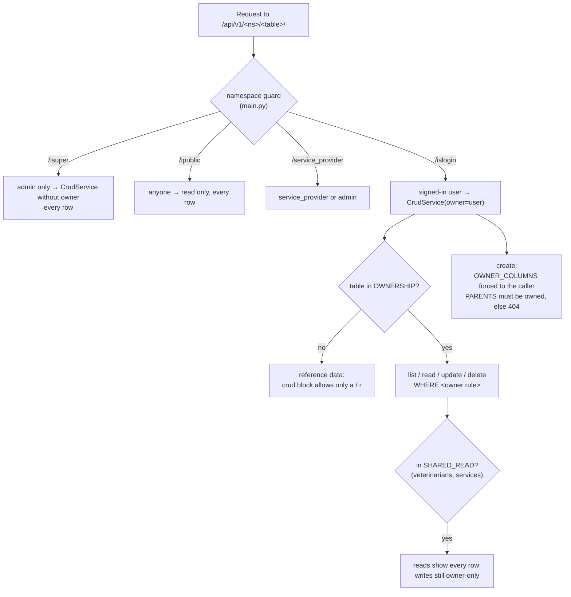
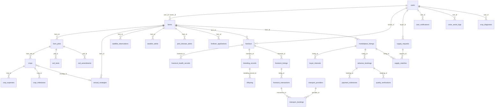

# CropSense AI — Data Model

_Last updated: 2026-09-28 (branch `feat/livestock-assistant-services-i18n`)._

The 58 tables: where they are defined, how they link, who can read and change each one, and how to change the schema safely. For the code that reads and writes them, see [BACKEND.md](BACKEND.md).

| Section | Covers |
|---|---|
| [1. Source of truth](#1-source-of-truth) | Model JSON → generated SQL and code |
| [2. All tables](#2-all-tables) | Every table with columns, access letters, owner rule and links |
| [3. Who can see and change what](#3-who-can-see-and-change-what) | How ownership is enforced |
| [4. Main relations](#4-main-relations) | Entity diagram of the core tables |
| [5. Changing the schema](#5-changing-the-schema) | Step by step, additive only |
| [6. Migrations](#6-migrations) | What exists and what deploy applies |
| [7. Data-model issues](#7-data-model-issues) | Things to fix |

---

## 1. Source of truth

Each table is one JSON file in `database/Model/<name>.json`:

```jsonc
{
  "name": "crop",              // model name → Crop, crop_service.py, /islogin/crop/
  "table": "crops",            // SQL table
  "crud": {                     // who may do what (c create, r read one, u update, a list, d delete, p paginate)
    "isuper":  ["c","r","u","a","d"],
    "islogin": ["c","r","a","u","d"],
    "public":  ["r"],
    "roles":   { "service_provider": ["c","r","u","a","d"] }
  },
  "enable": 1,                 // adds an `enable` SMALLINT DEFAULT 1 column (not an on/off switch for the table)
  "relations": { "farm_plot": { "name": "farm_plot_id", "key": "id", "table": "farm_plots" } },
  "data": [ { "name": "crop_name", "datatype": "string", "mysql_data": "varchar(255)", "sql_attribute": "NOT NULL" } ]
}
```

- **Default columns:** every table also gets `id BIGSERIAL`, `created_at` and `updated_at`.
- **Generator:** `php setup.php` (settings in `config.json`, generator in `vendor/puneetxp/compile-php`) writes the SQL and code from these files:
  - `database/structure.sql`, `database/relation.sql`
  - `python/app/models`, `python/app/orm`, `python/app/services/<table>_service.py`, `python/app/api/{isuper,islogin,ipublic,roles}`
  - `solidjs/src/shared/{Interface,Service,Store}`
- **Database:** PostgreSQL, with the pgvector extension for supply-request similarity search.

---

## 2. All tables

Column legend:

| Column | Meaning |
|---|---|
| Cols | Columns declared in the JSON, not counting `id`, `created_at`, `updated_at`, `enable` |
| isuper / islogin / public | The `crud` letters for that role |
| Owner rule | The SQL condition from `core/ownership.py` that limits `/islogin` to the caller's own rows. "me" = the caller's user id; "my X" = rows of X the caller owns |
| reference data | No owner rule, so `/islogin` can only read, and sees every row |

### Users and roles

| Model → table | Cols | isuper | islogin | public | Owner rule (islogin) | Links to |
|---|---|---|---|---|---|---|
| `user` → `users` | 21 | carud | aru | – | `t.id = me` | – |
| `role` → `roles` | 1 | carup | – | – | – | – |
| `active_role` → `active_roles` | 2 | carudp | ar | – | `t.user_id = me` | `user_id`→users, `role_id`→roles |
| `ai_usage_quota` → `ai_usage_quota` | 6 | carud | ar | – | `t.user_id = me` | `user_id`→users |
| `system_setting` → `system_settings` | 3 | carud | – | – | – | – |
| `user_notification` → `user_notifications` | 8 | carud | arud | – | `t.user_id = me` | `user_id`→users |
| `push_subscription` → `push_subscriptions` | 5 | ard | – | – | – | – |

### Farms and crops

| Model → table | Cols | isuper | islogin | public | Owner rule (islogin) | Links to |
|---|---|---|---|---|---|---|
| `farm` → `farms` | 45 | carud | carud | – | `t.user_id = me OR t.owner_id = me` | `user_id`, `owner_id`→users |
| `farm_plot` → `farm_plots` | 19 | carud | carud | – | `t.farm_id IN (my farms)` | `farm_id`→farms |
| `crop` → `crops` | 15 | carud | carud | – | `t.farm_plot_id IN (my farm_plots)` | `farm_plot_id`→farm_plots, `strategy_id`→annual_strategies |
| `crop_expense` → `crop_expenses` | 5 | carud | carud | – | `t.crop_id IN (my crops)` | `crop_id`→crops |
| `crop_milestone` → `crop_milestones` | 11 | carud | carud | – | `t.crop_id IN (my crops)` | `crop_id`→crops |
| `annual_strategy` → `annual_strategies` | 18 | carud | carud | – | `t.farmer_id = me OR t.farm_id IN (my farms)` | `farm_id`→farms, `farmer_id`→users |
| `crop_diagnosis` → `crop_diagnoses` | 16 | ard | ard | – | `t.user_id = me` | `user_id`→users |
| `satellite_observation` → `satellite_observations` | 11 | ard | ar | – | `t.farm_id IN (my farms)` | `farm_id`→farms |

### Soil, fertilizer, weather, pests

| Model → table | Cols | isuper | islogin | public | Owner rule (islogin) | Links to |
|---|---|---|---|---|---|---|
| `soil_test` → `soil_tests` | 39 | carud | carud | – | `t.plot_id IN (my farm_plots)` | `plot_id`→farm_plots |
| `soil_test_result` → `soil_test_results` | 23 | carud | carud | – | `t.farm_id IN (my farms)` | `farm_id`→farms, `plot_id`→farm_plots |
| `soil_amendment` → `soil_amendments` | 30 | carud | carud | – | `t.plot_id IN (my farm_plots)` | `follow_up_soil_test_id`→soil_tests, `plot_id`→farm_plots |
| `fertilizer_application` → `fertilizer_applications` | 28 | carud | carud | – | `t.farm_id IN (my farms)` | `farm_id`→farms, `plot_id`→farm_plots, `crop_id`→crops, `soil_test_before_id`→soil_test_results, `soil_test_after_id`→soil_test_results |
| `soil_moisture_data` → `soil_moisture_data` | 7 | carud | ar | r | reference data (read-only) | – |
| `weather_forecast` → `weather_forecasts` | 36 | carud | ar | ar | reference data (read-only) | – |
| `weather_alert` → `weather_alerts` | 10 | carud | ar | – | `t.farm_id IN (my farms)` | `farm_id`→farms |
| `pest_disease_alert` → `pest_disease_alerts` | 16 | carud | carud | – | `t.farm_id IN (my farms)` | `crop_id`→crops, `farm_id`→farms |
| `pest_disease_data` → `pest_disease_data` | 18 | carud | ar | – | reference data (read-only) | – |
| `shc_state_district_code` → `shc_state_district_codes` | 4 | ar | ar | – | reference data (read-only) | – |
| `slusi_lcc_report` → `slusi_lcc_reports` | 18 | ar | ar | – | reference data (read-only) | – |
| `slusi_microwatershed_map` → `slusi_microwatershed_maps` | 4 | ar | ar | – | reference data (read-only) | – |
| `slusi_ingestion_run` → `slusi_ingestion_runs` | 6 | ar | – | – | – | – |
| `ndap_ingestion_run` → `ndap_ingestion_runs` | 7 | ar | – | – | – | – |
| `ndap_downloaded_file` → `ndap_downloaded_files` | 3 | – | – | – | – | – |

### Livestock

| Model → table | Cols | isuper | islogin | public | Owner rule (islogin) | Links to |
|---|---|---|---|---|---|---|
| `livestock` → `livestock` | 19 | carud | carud | – | `t.farmer_id = me` | `farm_id`→farms, `farmer_id`→users |
| `livestock_health_record` → `livestock_health_records` | 8 | carud | carud | – | `t.livestock_id IN (my livestock)` | `livestock_id`→livestock |
| `breeding_record` → `breeding_records` | 13 | carud | carud | – | `t.farmer_id = me` | `livestock_id`→livestock, `farmer_id`→users, `mate_id`→livestock |
| `offspring` → `offspring` | 13 | carud | carud | – | `t.farmer_id = me` | `breeding_record_id`→breeding_records, `livestock_id`→livestock, `farmer_id`→users |
| `livestock_roi_prediction` → `livestock_roi_predictions` | 49 | carud | carud | – | `t.user_id = me OR t.animal_id IN (my livestock)` | `animal_id`→livestock, `user_id`→users |
| `livestock_listing` → `livestock_listings` | 38 | carud | carud | r | `t.farmer_id = me` | `livestock_id`→livestock, `farmer_id`→users |
| `livestock_marketplace_listing` → `livestock_marketplace_listings` | 23 | carud | carud | – | `t.farmer_id = me` | `livestock_id`→livestock, `farmer_id`→users |
| `livestock_transaction` → `livestock_transactions` | 21 | carud | carud | – | `t.seller_id = me OR t.buyer_id = me` | `listing_id`→livestock_listings, `seller_id`→users, `buyer_id`→users |
| `veterinarian` → `veterinarians` | 16 | carud | carud | ar | `t.added_by_user_id = me` · shared read | – |

### Marketplace and supply

| Model → table | Cols | isuper | islogin | public | Owner rule (islogin) | Links to |
|---|---|---|---|---|---|---|
| `marketplace_listing` → `marketplace_listings` | 21 | carud | carud | r | `t.farmer_id = me` | `farm_id`→farms, `farmer_id`→users |
| `buyer_interest` → `buyer_interests` | 15 | carud | carud | – | `t.listing_id IN (my marketplace_listings)` | `listing_id`→marketplace_listings |
| `advance_booking` → `advance_bookings` | 13 | carud | carud | – | `t.buyer_id = me OR t.farmer_id = me` | `listing_id`→marketplace_listings, `buyer_id`→users, `farmer_id`→users |
| `payment_milestone` → `payment_milestones` | 8 | carud | carud | – | `t.booking_id IN (my advance_bookings)` | `booking_id`→advance_bookings |
| `quality_verification` → `quality_verifications` | 8 | carud | carud | – | `t.booking_id IN (my advance_bookings)` | `booking_id`→advance_bookings |
| `supply_request` → `supply_requests` | 20 | carud | carud | – | `t.buyer_id = me` | `buyer_id`→users |
| `supply_match` → `supply_matches` | 15 | carud | carud | – | `t.farmer_id = me OR t.request_id IN (my supply_requests)` | `request_id`→supply_requests, `listing_id`→marketplace_listings, `farmer_id`→users |

### Transport and services

| Model → table | Cols | isuper | islogin | public | Owner rule (islogin) | Links to |
|---|---|---|---|---|---|---|
| `transport_provider` → `transport_providers` | 20 | carud | carud | r | `t.user_id = me` | `user_id`→users |
| `transport_booking` → `transport_bookings` | 29 | carud | carud | – | `t.provider_id IN (my transport_providers) OR t.transaction_id IN (my livestock_transactions)` ⚠ not `requester_id` | `transaction_id`→livestock_transactions, `provider_id`→transport_providers, `requester_id`→users |
| `service` → `services` | 16 | carud | ar · role `service_provider`: carud | ar | `t.user_id = me` · shared read | – |

### Market reference data

| Model → table | Cols | isuper | islogin | public | Owner rule (islogin) | Links to |
|---|---|---|---|---|---|---|
| `market_price` → `market_prices` | 16 | carud | ar | r | reference data (read-only) | `listing_id`→marketplace_listings, `booking_id`→advance_bookings, `transaction_id`→livestock_transactions |
| `crop_market_data` → `crop_market_data` | 8 | carud | – | r | – | – |
| `price_prediction` → `price_predictions` | 17 | carud | ar | r | reference data (read-only) | – |
| `msp_rate` → `msp_rates` | 9 | carud | ar | r | reference data (read-only) | – |
| `historical_yield` → `historical_yields` | 21 | carud | ar | ar | reference data (read-only) | – |
| `crop_profitability` → `crop_profitability` | 28 | carud | ar | ar | reference data (read-only) | – |
| `seasonal_trend` → `seasonal_trends` | 24 | carud | ar | ar | reference data (read-only) | – |
| `opportunity_cost` → `opportunity_costs` | 27 | carud | ar | ar | reference data (read-only) | – |

### AI audit

| Model → table | Cols | isuper | islogin | public | Owner rule (islogin) | Links to |
|---|---|---|---|---|---|---|
| `voice_assist_log` → `voice_assist_logs` | 14 | ard | ar | – | `t.user_id = me` | `user_id`→users |

Some tables have no controller for a role, so the matching generated frontend service returns 404:
- no `/islogin` controller: `roles`, `push_subscriptions`, `crop_market_data`, `slusi_ingestion_runs`, `ndap_ingestion_runs`, `ndap_downloaded_files`
- no controller at all: `ndap_downloaded_files` (its `crud` block is empty)

See [FRONTEND.md §5](FRONTEND.md#5-known-frontend--backend-gaps-verified-2026-09-28) for which of these the frontend still calls.

---

## 3. Who can see and change what



All rules live in `python/app/core/ownership.py`:

| Rule | What it does | Examples |
|---|---|---|
| `OWNERSHIP` | One SQL condition per table, applied to every `/islogin` list, read, update and delete | `crops` → `farm_plot_id IN (plots on my farms)` |
| `SHARED_READ` | Signed-in users can read every row; writes stay owner-only | `veterinarians`, `services` |
| `OWNER_COLUMNS` | Set to the caller's id on create, whatever the client sent; cannot be changed on update | `farms.user_id` + `owner_id`, `livestock.farmer_id`, `supply_requests.buyer_id`, `veterinarians.added_by_user_id`, `services.user_id` + `added_by_user_id` |
| `PARENTS` | Parent ids that must point at something the caller owns, else 404 | `farm_plots.farm_id` → farms; `crops.farm_plot_id` → farm_plots; `fertilizer_applications.farm_id / plot_id / crop_id`; `payment_milestones.booking_id` → advance_bookings |

**Custom routers (`api/v1`)** don't go through `CrudService`, so they must check ownership themselves:
- **Raw-SQL helpers:** `services/farm_access.py`.
- **Router-level guard:** `enforce_livestock_owner` in `livestock_health.py`.
- **Per-handler checks:** for example `_ensure_self` in `ai_quota.py`, and the `farmer_id` check on annual strategies.

**Admins** use `/isuper/*`, which is never owner-scoped.

---

## 4. Main relations



Reference tables (`market_prices`, `msp_rates`, `historical_yields`, `crop_profitability`, `seasonal_trends`, `opportunity_costs`, `price_predictions`, `weather_forecasts`, `soil_moisture_data`, `pest_disease_data`, `slusi_*`, `shc_state_district_codes`) are keyed by crop, state and district, not by user. They are filled by ingestion jobs and scripts (see [ARCHITECTURE.md §9](ARCHITECTURE.md#9-background-work-and-data-ingestion)).

---

## 5. Changing the schema

**Additive only.** Never drop or rename a table, column or data without approval. Never hand-write `CREATE TABLE`, and never add SQLAlchemy models, `create_all` or Alembic.

1. **Edit or add** `database/Model/<name>.json`: columns in `data`, links in `relations`, access in `crud`.
2. **Generate in a scratch copy** of the repo. Run `php setup.php` there, not in your working tree.
3. **Copy back** only the new files and the additive diffs:
   - `structure.sql` / `relation.sql`
   - `python/app/{models,orm,services/<table>_service.py,api/<role>/<table>}`
   - `api/routers.py`
   - `solidjs/src/shared/*`

   Don't overwrite controllers flagged `true` under `config.json → table`.
4. **Set access for signed-in users:** for an owner-scoped table, add its rule to `OWNERSHIP` (and to `OWNER_COLUMNS` / `PARENTS` if needed) in `core/ownership.py`. Without a rule, the `crud` block must give `islogin` only `a` / `r`.
5. **Write a migration** `database/migrations/<date>-<topic>.sql` using only `CREATE TABLE IF NOT EXISTS`, `ADD COLUMN IF NOT EXISTS` and guarded FK constraints, so it can safely run again.
6. **Add it to deploy:** append the file to the `MIGRATIONS=(…)` list in `deploy-gcp.sh` (step 6). Deploy runs the whole list on every backend deploy, in one connection, retrying up to 3 times.
7. **Check column names** against the JSON. The ORM silently drops unknown keys on write, which is how plots once wrote `is_active` into nothing (the real column is `enable`).

---

## 6. Migrations

**On a fresh database,** deploy loads `structure.sql`, `relation.sql` and `insert.sql` in one transaction (with `CREATE EXTENSION vector`).

**On an existing database,** deploy skips that step and applies only the files in `MIGRATIONS=(…)`:

| File | Adds | In deploy list |
|---|---|---|
| `create_push_subscriptions_table.sql` | `push_subscriptions` | ✅ |
| `2026-09-27-services-livestock-name.sql` | `services` table, `livestock.name` | ✅ |
| `2026-09-27-crops-supporting-crop.sql` | `crops.parent_crop_id`, `crop_role` | ✅ |
| `2026-09-27-ndap-ingestion-tables.sql` | `ndap_ingestion_runs`, `ndap_downloaded_files` | ✅ |
| `2026-09-27-voice-assist-logs.sql` | `voice_assist_logs` | ✅ |
| `2026-09-27-crop-diagnoses.sql` | `crop_diagnoses` | ✅ |
| `2026-09-27-satellite-observations.sql` | `satellite_observations` | ✅ |
| `2026-09-26-cloudsql-additive.sql` | 17 tables, e.g. `breeding_records`, `offspring`, `soil_tests`, `soil_amendments`, `livestock_roi_predictions`, `user_notifications`, `veterinarians`, `msp_rates`, `system_settings`, `weather_forecasts` | ⚠ **not in the list** |
| Older files (`001_create_marketplace_tables.sql`, `slusi_integration.sql`, `msp_rates.sql`, `soil_moisture.sql`, `system_settings.sql`, `fix_*`, `migrate_uuid_to_bigint*`, `recreate_with_bigserial.sh`, `run_users_table_fix.sh`) | Earlier one-off changes | Not in the list; historical |

---

## 7. Data-model issues

1. **`2026-09-26-cloudsql-additive.sql` is not in the deploy migration list.** A fresh database gets those tables from `structure.sql`. An existing database only has them if someone ran the file by hand. Check production, and add the file to `MIGRATIONS` (it is safe to re-run).
2. **Transport bookings the requester can't see.** The `transport_bookings` owner rule covers the provider and the transaction's buyer and seller, but not `requester_id`. A booking made without a livestock transaction (`transaction_id` null) is invisible to its requester on `/transport/tracking`.
3. **Two farm shapes.** The `farms` table columns (`location_state`, `total_area`, …) differ from the `/farms` API shape (`state`, `total_area_acres`, …). Pages that read `/islogin/farm/` see different field names from pages that read `/farms` (see [FRONTEND.md §5](FRONTEND.md#5-known-frontend--backend-gaps-verified-2026-09-28)).
4. **No pagination on `/islogin` lists.** Every visible row is returned. Growing tables (`voice_assist_logs`, `user_notifications`, `satellite_observations`) will get slow on the phone.
5. **Booking status values are free text.** The `advance_bookings.status` values used by the backend (`pending_farmer_confirmation`, `pending`, `confirmed`, `quality_verified`, `disputed`, `completed`, `cancelled`) are not written down in the model JSON. Add them to the column `COMMENT`, as `crops.status` does.
