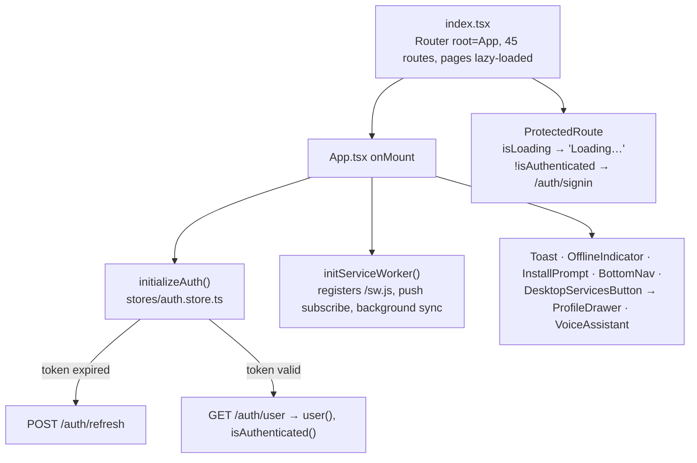
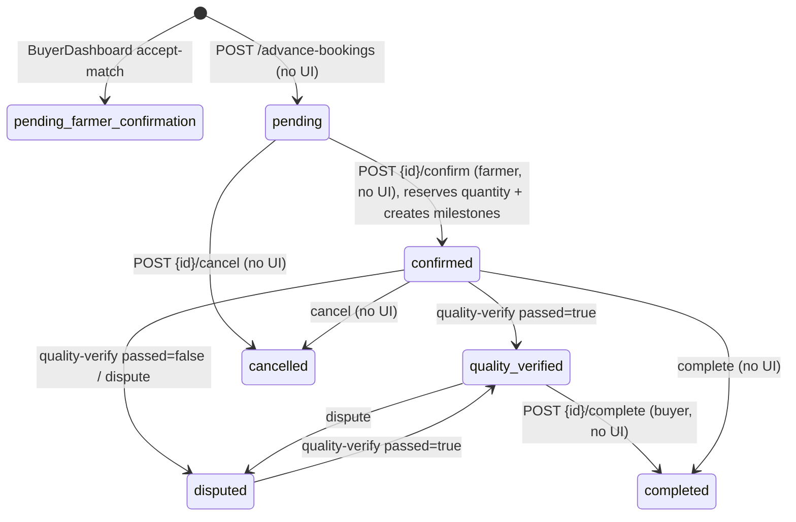
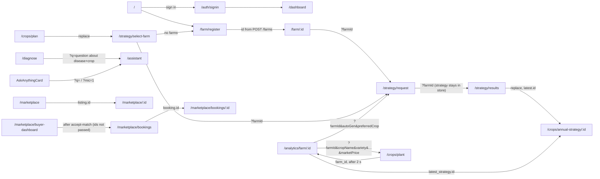

# CropSense AI — Frontend

_Last updated: 2026-09-28 (branch `feat/livestock-assistant-services-i18n`)._

How the SolidJS app (`solidjs/`) is built, every route it has, what each route sends to and gets back from the backend, how data passes from page to page, and where the frontend and backend don't match. For the backend, data layer, AI and deployment, see [ARCHITECTURE.md](ARCHITECTURE.md).

| Section | Covers |
|---|---|
| [1. Frontend architecture](#1-frontend-architecture) | Boot, shell, API client, the three ways pages call the backend, browser storage |
| [2. Route map](#2-route-map) | All 45 routes: page file, guard, params, backend calls |
| [3. Data contracts by feature](#3-data-contracts-by-feature) | Request and response fields for every call |
| [4. How data passes between pages](#4-how-data-passes-between-pages) | Page-to-page handoffs |
| [5. Known gaps](#5-known-frontend--backend-gaps-verified-2026-09-28) | Broken flows, security issues, mismatches |

---

## 1. Frontend architecture

All paths in §1–§5 are relative to `solidjs/src/` (frontend) and `python/app/` (backend). Backend paths are shown **without** the `/api/v1` prefix.

### 1.1 Boot and shell

- **`ProtectedRoute`** checks only "signed in". It checks **no role**, so `/admin/analytics` opens for any signed-in user.
- **Public routes:** `/`, `/auth/signin`, `/auth/signup`, `/marketplace`, `/marketplace/:id`. Every other route is wrapped in `ProtectedRoute`.
- **Route ranking:** `@solidjs/router` scores a static segment above a `:param`, so `/marketplace/bookings` wins over `/marketplace/:id` even though `/marketplace/:id` is declared first.
- **Shell pieces:**
  - `BottomNav` and `ServicesMenu` are static link grids. `ServicesMenu`'s `SERVICE_GROUPS` ids are also the `menu` list sent to the assistant.
  - `ProfileDrawer` holds the services menu, `LanguageSwitcher`, the profile link and sign-out.
  - `VoiceAssistant` floats on every page except `/assistant` and `/auth/*`.

### 1.2 Transport: `lib/api-client.ts`

| Aspect | Behaviour |
|---|---|
| Base URL | `${VITE_API_URL}/api/v1`, falling back to `http://localhost:8000/api/v1`. A caller path that already starts with `/api/v1/` has the duplicate removed. |
| Token | `localStorage.access_token` is sent as `Authorization: Bearer …`, unless the call sets `requiresAuth:false`. For Firebase sign-in, this value **is the Firebase ID token**. |
| Timeout | 30 s by default. Sign-in uses 90 s; `/vision/diagnose-crop` and `/satellite/*` also use 90 s. A timeout becomes `{status:408}` and is not retried. |
| Retry | Up to 3 attempts (1 s, 2 s backoff) on network errors or 5xx, for **every method, including POST** (see §5). |
| 401 | `POST /auth/refresh-token {username, refresh_token}` stores the new tokens, then the request is retried once. |
| Cache | In-memory, GET only, 5 min default TTL, keyed `method:url:body`. Identical in-flight GETs share one request. Not cleared on sign-out. |
| Errors | Normalised to `ApiError {message, status, detail, errors}`. |

### 1.3 Three ways pages call the backend

| Style | Where | URL it produces | Used for |
|---|---|---|---|
| **Registry + service** | `services/*.ts` → `buildUrl(category, name, params)` from `config/api-registry.json` (throws `Endpoint not found` for an unknown key) | `/farms`, `/annual-strategy`, `/ai-quota/status/{id}`, … | Business logic in `api/v1` |
| **Direct `apiClient`** | Inside pages and components, e.g. `ClimateHub`, `MyListings`, `Notifications`, `plots/Create` | Literal path | Quick one-off calls |
| **Generated `ModelService`** | `shared/Service/Services.ts` (58 services) → `shared/Service/ModelService.ts` | `"api/<table>"` becomes `/islogin/<table>/`; a path starting with `/` is used as-is; any other `"api/x/y"` becomes `/x/y/` | Plain owner-scoped CRUD |

`ModelService` methods:

| Method | Request |
|---|---|
| `all()` | GET `base` |
| `get(id)` | GET `base+id` |
| `create(row)` | POST `base` |
| `update(row)` | PUT `base+id` |
| `upsert(rows)` | PUT or POST per row |
| `del(id)` | DELETE `base+id` |
| `where(...)` | GET `base`, then filtered **in the browser** |
| `bulkImport` | POST `base + bulk_ai_import` |

GETs bypass the apiClient cache. Errors are swallowed and return `undefined`, so a 404 looks like "no data". Rows are mirrored into IndexedDB `rural_farming_db` (one store per table) and into a Solid store.

The older `shared/Service/{Livestock,Weather,PestDisease,User,Marketplace,Payments,Supply,Transport}.ts` are imported by no page. `Services.ts` holds the live copies.

### 1.4 Where the browser keeps data

| Store | Key / name | Written by | Contents |
|---|---|---|---|
| localStorage | `access_token`, `id_token`, `refresh_token`, `username`, `token_expires_at` | `AuthService.storeTokens` | Session tokens |
| localStorage | `user_data` | `auth.store` after `GET /auth/user` | Cached profile (`id`, `user_type`, `language_preference`, …) |
| localStorage | `app_lang` | `i18n.store.setLang` | UI language. It follows `user().language_preference` until the viewer picks one. A picker change is **not** saved to the backend; only `/users/profile` saves it. |
| localStorage | `app_config` (v3) | `app-config.store` (the `/settings` page) | 14 dashboard-section toggles (`services`, `stats` off by default) and 5 optional crop-form fields |
| localStorage | `assistant_chat` | `pages/Assistant.tsx` | Full-page chat history |
| localStorage | `offline-queue` | `utils/offlineQueue.ts` | Queued writes. `queueAction()` has no callers today, so the queue is always empty. |
| IndexedDB | `rural_farming_db` | `ModelService` | Mirror of generated-CRUD rows |
| SW cache | `farming-platform-v1.1` | `public/sw.js` | `/api/*` GETs network-first (503 JSON when offline); static assets cache-first; navigation falls back to `/index.html` |
| Memory | Solid stores | `stores/auth`, `farm`, `strategy`, `marketplace`, `livestock-marketplace` | Current user, `currentFarm`, `currentStrategy`, list filters |

### 1.5 i18n and PWA

- **i18n:**
  - `stores/i18n.store.ts` provides `t(key)`.
  - Dictionaries exist for en, hi, mr and pa.
  - 15 selectable languages are listed in `languages.json`; the assistant replies in any of them.
  - `scripts/i18n-check.mjs` finds missing keys before a build.
- **PWA:**
  - Files: `public/sw.js` and `manifest.json`.
  - Push subscription uses `VITE_VAPID_PUBLIC_KEY`. The backend's `GET /notifications/vapid-public-key` is never called.
  - `NotificationPermissionPrompt` is mounted only on `/dashboard`.
  - A push payload's `url` (default `/`) is opened when the notification is clicked.

---

## 2. Route map

**G** = guard: 🔓 public, 🔒 `ProtectedRoute`. "Reads" = route/query params the page uses. Backend calls are summarised here; §3 gives the request and response fields.

### 2.1 Entry, account, shell

| Route | G | Page | Reads | Backend calls |
|---|---|---|---|---|
| `/` | 🔓 | `pages/Home.tsx` | – | `GET /analytics/profile-status` (only when signed in) |
| `/auth/signin` | 🔓 | `pages/auth/SignIn.tsx` + `components/auth/*` | – | Firebase SDK, `POST /auth/google`, `GET /auth/user`; legacy `POST /auth/signin`, `/auth/verify-mfa` |
| `/auth/signup` | 🔓 | `pages/auth/SignUp.tsx` | – | `POST /auth/signup`, `/auth/verify-email`, `/auth/resend-verification`, `GET /address/pincode/{pin}` |
| `/dashboard` | 🔒 | `pages/Dashboard.tsx` + `components/dashboard/*`, `board/*` | – | `GET /analytics/profile-status`, `GET /livestock/?farmer_id=&limit=1000`, `GET /livestock/farmer/{id}/portfolio`, `GET /predictive-analytics/predict-demand` (up to 8 items) |
| `/assistant` | 🔒 | `pages/Assistant.tsx` | `?q=`, `?mic=1` | `POST /voice/assist`, plus the save endpoints in §3.3 |
| `/menu` | 🔒 | `pages/AllServices.tsx` → `ServicesMenu` | – | none |
| `/settings` | 🔒 | `pages/Configuration.tsx` | – | none (localStorage `app_config`) |
| `/users/profile` | 🔒 | `pages/users/Profile.tsx` | – | `GET` / `PUT /users/profile` |
| `/users/security` | 🔒 | `pages/users/Security.tsx` | – | `GET /users/profile`, `POST /users/change-password`, `POST /users/me/mfa/{enable,disable}` |
| `/notifications` | 🔒 | `pages/notifications/Notifications.tsx` | – | `GET /islogin/user_notification/`, `POST /notifications/{id}/read`, `POST /notifications/read-all`, `DELETE /islogin/user_notification/{id}` |
| `/quota/history` | 🔒 | `pages/quota/QuotaHistory.tsx` | – | `GET /ai-quota/status/{user.id}` (the usage-history table is mock data) |

### 2.2 Farm, plots, crops, strategy

| Route | G | Page | Reads | Backend calls |
|---|---|---|---|---|
| `/farm` | 🔒 | `pages/farm/Index.tsx` | – | `GET /islogin/farm/` (raw ORM shape) |
| `/farm/register` | 🔒 | `pages/farm/Register.tsx` + `FarmRegistrationForm`, `FarmAddressFields` | – | `POST /farms`, `GET /address/pincode/{pin}`, `GET /farms/location-lookup`, `GET /farms/soil-lookup/v2`, `GET /ai-quota/status/1` ⚠ |
| `/farm/:id` | 🔒 | `pages/farm/FarmDashboard.tsx` + `FarmProfileDashboard`, `FarmEditForm`, `PlotManagement`, `SatelliteHealthCard` | `:id` | `GET` / `PUT` / `DELETE /farms/{id}`, `GET` / `POST /farms/{id}/plots`, `DELETE /farms/{id}/plots/{pid}`, `GET /satellite/farm/{id}[?refresh=true]` |
| `/analytics/farm/:id` | 🔒 | `pages/farm/FarmAnalytics.tsx` | `:id` | `GET /analytics/farm/{id}`, `POST /crops/{cropId}/expenses`, `DELETE /islogin/crop/{cropId}` |
| `/plots/create` | 🔒 | `pages/plots/Create.tsx` | – | `GET /farms`, `POST /farms/{farm_id}/plots` |
| `/plots/analyze` | 🔒 | `pages/plots/Analyze.tsx` | – | none (placeholder) |
| `/plots/compare` | 🔒 | `pages/plots/Compare.tsx` | – | none (placeholder) |
| `/crops/plant` | 🔒 | `pages/crops/PlantCrop.tsx` | `?farmId&cropName&variety&season&area&plantingDate&harvestDate&expectedYield&marketPrice` | `POST /crops/quick-plant` |
| `/crops/my-crops` | 🔒 | `pages/crops/MyCrops.tsx` | – | `GET /crops/my-crops` |
| `/crops/annual-strategy/:id` | 🔒 | `pages/crops/AnnualStrategyDetail.tsx` → `StrategyResults` | `:id` | `GET /annual-strategy/{id}` (403 unless it is the caller's own strategy) |
| `/crops/plan` | 🔒 | redirect in `index.tsx` | – | replaces itself with `/strategy/select-farm` |
| `/diagnose` | 🔒 | `pages/crops/Diagnose.tsx` | – | `GET /crops/my-crops`, `GET /vision/diagnoses?limit=8`, `POST /vision/diagnose-crop` |
| `/strategy/select-farm` | 🔒 | `pages/strategy/SelectFarm.tsx` | – | `GET /farms` |
| `/strategy/request` | 🔒 | `pages/strategy/Request.tsx` + `components/strategy/*`, `components/quota/*` | `?farmId` (required), `?autoGen=true`, `?preferredCrop` | `GET /farms/{id}`, `GET /ai-quota/status/{user.id}` (and `/1` ⚠), `POST /annual-strategy` |
| `/strategy/results` | 🔒 | `pages/strategy/Results.tsx` | `?farmId` | `GET /annual-strategy/list` (filtered by farm in the browser) ⚠ |

### 2.3 Livestock, climate, soil, pests, services

| Route | G | Page | Reads | Backend calls |
|---|---|---|---|---|
| `/livestock` | 🔒 | `pages/livestock/PashuHome.tsx` + `AddLivestockCard` | – | `GET /islogin/livestock/`, `GET /livestock-marketplace/listings?page=1&page_size=6`, `GET /veterinary/doctors`, `POST /voice/assist` (`task:add_livestock`), `GET /islogin/farm/` |
| `/livestock/hub` | 🔒 | `pages/livestock/LivestockHub.tsx` | – | `GET /islogin/livestock/`, `GET /islogin/livestock_health_record/` ("Upcoming Vax" is hard-coded to 12) |
| `/livestock/diet-plan` | 🔒 | `pages/livestock/DietPlan.tsx` | – | none (`utils/dietPlan.calculateDietPlan` runs in the browser) |
| `/livestock/doctors` | 🔒 | `pages/livestock/VeterinaryDoctors.tsx` | – | `GET /veterinary/doctors?species&available_only`, `POST /veterinary/doctors` |
| `/climate/hub` | 🔒 | `pages/climate/ClimateHub.tsx` | – | `GET /farms` (first farm with lat/lon), `GET /weather/forecast?latitude&longitude&days=7`, `GET /severe-weather/alerts/active?farm_id` |
| `/soil/hub` | 🔒 | `pages/soil/SoilFertilizerHub.tsx` | – | `GET /islogin/farm/`, `GET /islogin/farm_plot/`, `GET /islogin/fertilizer_application/`; plus `GET /soil/health/`, `/soil/map/`, `/soil/fertilizer-recommendations/` ⚠ (none of these three exist) |
| `/pest-disease/hub` | 🔒 | `pages/pest-disease/PestDiseaseHub.tsx` | – | `GET /islogin/pest_disease_alert/`, `GET /islogin/pest_disease_data/`, `POST /islogin/pest_disease_data/bulk_ai_import` ⚠ |
| `/services` | 🔒 | `pages/services/ServicesDirectory.tsx` | – | `GET /islogin/service/`; writes go to `/isuper/service/` (admin) or `/service_provider/service/` (service_provider), chosen by `serviceWriteScope()` from `user().user_type` |

### 2.4 Marketplace, bookings, transport, admin

| Route | G | Page | Reads | Backend calls |
|---|---|---|---|---|
| `/marketplace` | 🔓 | `pages/marketplace/Browse.tsx` + `ListingGrid`, `SearchFilters` | – (filters in `marketplace.store`) | `GET /marketplace/listings` (no auth, 60 s cache) |
| `/marketplace/:id` | 🔓 | `pages/marketplace/Detail.tsx` + `ListingDetail`, `BuyerInterestForm` | `:id` | `GET /marketplace/listings/{id}` (no auth), `POST /marketplace/buyer-interest` (needs sign-in ⚠) |
| `/marketplace/my-listings` | 🔒 | `pages/marketplace/MyListings.tsx` | – | `GET /marketplace/my-listings` |
| `/marketplace/buyer-dashboard` | 🔒 | `pages/marketplace/BuyerDashboard.tsx` + `SupplyRequestForm`, `SupplyMatches` | – | `POST /supply-requests/`, `POST /supply-requests/{rid}/accept-match`, `POST /supply-requests/{rid}/refresh-matches` ⚠ (raw `fetch`, wrong host, no token) |
| `/marketplace/bookings` | 🔒 | `pages/marketplace/Bookings.tsx` | – (signals `role`, `statusFilter`) | `GET /marketplace/advance-bookings?role=&status=` |
| `/marketplace/bookings/:id` | 🔒 | `pages/marketplace/BookingDetails.tsx` + `QualityVerificationForm`, `QualityHistory`, `QualityDispute` | `:id` | `GET /marketplace/advance-bookings/{id}`, `POST /upload/image`, `POST …/{id}/quality-verify`, `POST …/{id}/dispute` |
| `/marketplace/intelligence` | 🔒 | `pages/marketplace/MarketIntelligence.tsx` | – | `GET /market-intelligence/trends/crop/{crop}`, `GET /predictive-analytics/opportunity-score`, `GET /predictive-analytics/supply-demand-gaps` |
| `/marketplace/supply-planning` | 🔒 | `pages/marketplace/SupplyPlanning.tsx` | – | `GET /predictive-analytics/buyer-supply-planning`, `POST /predictive-analytics/predict-price` (params in the query string) |
| `/livestock-marketplace` | 🔒 | `pages/livestock-marketplace/Browse.tsx` | – (store filters) | `GET /livestock-marketplace/listings` |
| `/transport/tracking` | 🔒 | `pages/transport/TransportTracking.tsx` | – | `GET /islogin/transport_booking/` |
| `/admin/analytics` | 🔒 ⚠ no admin check | `pages/admin/PlatformAnalytics.tsx` | – | `GET /market-intelligence/summary?state=` |

**Pages that exist but have no route:**
- `pages/admin/QuotaMonitoring.tsx`
- `pages/marketplace/BrowseInfinite.tsx`
- `pages/test/GeolocationTest.tsx`

**Components that no route renders:**
- `components/transport/{TransportBooking,TransportTracking,TransportProviderRegistration}.tsx`
- `components/farm/FarmList.tsx`
- `components/notifications/NotificationSettings.tsx`
- `components/livestock/LivestockLocationFields.tsx`
- `components/marketplace/{MarketIntelligenceNav,QualityPremiumCalculator,VerifierManagement}.tsx`

**Services that no page imports:**
- `weather.service.ts`
- `soil.service.ts`: its registry keys are wrong, so it would throw if called.
- `pest-disease.service.ts`

---

## 3. Data contracts by feature

Only the fields the frontend actually sends or reads are listed. `→` separates the request from the response.

### 3.1 Auth and profile

| Call | Caller | Request | Response used |
|---|---|---|---|
| `POST /auth/google` (= `/auth/firebase`) | `auth.service.firebaseSignIn` | `id_token`, `refresh_token` | `access_token` (= ID token), `id_token`, `refresh_token`, `expires_in` (3600), `user.username` |
| `GET /auth/user` | `AuthService.getUser` | Bearer | `id`, `username`, `email`, `full_name`, `phone_number`, `user_type`, `is_verified`, `firebase_id`, `language_preference` |
| `POST /auth/refresh` | `auth.store` at startup and on a 60 s interval | `username`, `refresh_token` | New tokens |
| `POST /auth/refresh-token` | apiClient 401 handler | same | same |
| `POST /auth/signup` | `SignUpForm` | `username`, `password`, `email`, `full_name`, `phone_number?`, `user_type?`, `lat`/`lng`, `pincode`, `state`, `district`, `village`, `address_line` | `user_sub`, `user_confirmed` |
| `POST /auth/signin`, `/auth/verify-mfa` | `SignInForm`, `MFAVerification` (legacy password path) | `username`, `password` / `+ session`, `mfa_code` | Tokens, or `{challenge:'SMS_MFA', session}` |
| `POST /auth/verify-email`, `/auth/resend-verification`, `/auth/forgot-password`, `/auth/reset-password` | `EmailConfirmation`, `PasswordReset` | `username` (+ `confirmation_code`, `new_password`) | – |
| `POST /auth/logout` | `auth.store.signOut`, then `firebaseSignOut` | Bearer | – |
| `GET /address/pincode/{pin}` | `AddressFields`, `FarmAddressFields`, `DeliveryAddressFields` | – (no auth) | `state`, `district`, `villages[]` |
| `GET` / `PUT /users/profile` | `user.service.ts` | `full_name`, `email`, `phone_number`, `language_preference` | `{user:{full_name, user_type, username, is_active}, cognito_attributes}` |
| `POST /users/change-password` | `Security.tsx` | `previous_password`, `proposed_password` | – |
| `POST /users/me/mfa/{enable,disable}` | `Security.tsx` | – | MFA state is read back from `cognito_attributes.UserMFASettingList` (the backend MFA is still faked) |

### 3.2 Dashboard

`pages/Dashboard.tsx` makes one call and hands the result down as props. The `components/dashboard/*` cards make no calls of their own. `FarmJourney` and `board/AnalyticsBoard` load their own data through `board.service.ts`.

| Call | Caller | Request | Response used |
|---|---|---|---|
| `GET /analytics/profile-status` | `DashboardService.getProfileStatus` (`cache:false`; returns an empty stub on error) | – | `has_farms`, `has_crops`, `has_strategies`, `has_listings`, `is_onboarding_complete`, `farms[]`, `plots[]`, `dashboard_data{stats, active_crops (top 5), active_listings, upcoming_tasks (always []), buyer_interests, weather_alerts, strategy_timeline}` |
| `GET /livestock/?farmer_id={me}&limit=1000` | `BoardService.getLivestock` (60 s cache) | – | `quantity`, `purchase_price`, `expected_roi`, `species`, `breed`, `purpose`, `farm_id`, `break_even_date` |
| `GET /livestock/farmer/{id}/portfolio` | `BoardService.getPortfolio` | – | `total_investment`, `total_expected_returns`, `total_current_value`, `overall_roi_percentage` |
| `GET /predictive-analytics/predict-demand` | `BoardService.getDemandSignals` (up to 8 items, `allSettled`, 10 min cache) | `item_type`, `item_name`, `state`, `forecast_days=90` | `demand_level`, `growth_rate`, `confidence`, `data_points` |

The 12-month income projection (`buildIncomeProjection`) is computed in the browser from these results.

### 3.3 Assistant (floating panel, `/assistant`, `AddLivestockCard`)

The backend never writes records for the assistant; it only returns a proposal (see [ARCHITECTURE.md §8](ARCHITECTURE.md#8-ai-architecture)).

| Call | Request | Response used |
|---|---|---|
| `POST /voice/assist` (`services/assistant.service.assist`) | `text?` or `audio_base64?` (from `useRecorder.ts` MediaRecorder), `mime_type`, `duration_ms`, `lang`, `menu[{id,label}]` (from `ServicesMenu`), `animals[{id,label}]`, `farms[]`, `crops[]`, `history[{role,text}]` (last 10; backend max 20), `focus_animal_id`, `context` (Assistant page only; built by `assistant-context.ts`, capped at 11.5k chars; backend max 12,000), `task:'add_livestock'` + `draft` (AddLivestockCard only) | `{success, data}`. `data` contains `transcript`, `language`, `intent` (`navigate` \| `create` \| `answer` \| `clarify`), `confidence`, `auto_open`, `reply`, `matches[{id,score}]` (≤3), `proposal{entity, fields, summary}`, `animal_options`, `vet_help`, `missing`, `table{title,columns,rows}`, `model_used`. Guided mode adds `step`, `step_options`, `steps`, `steps_done`. `fallback:true` means a keyword match was used, not Gemini. |
| `GET /crops/my-crops` | `AssistantService.cropOptions` (60 s cache) | `crops[].id`, `crop_name`, `crop_variety`, `farm_name`, `plot_name`, `status`, `crop_role` |
| `GET /islogin/livestock/`, `GET /islogin/farm/` | pickers | animals and farms |
| `GET /veterinary/doctors` | `VoiceAssistant.loadVets` when `vet_help` is set | first 3 vets |
| `GET /analytics/profile-status`, `GET /livestock/?farmer_id=` | `assistant-context.ts` (2 min cache) | Farms, `dashboard_data` and herd, summarised into `context` |

**Where an approved proposal is saved** (`ProposalCard.save`, `AddLivestockCard`):

| `proposal.entity` | Endpoint | Body |
|---|---|---|
| `livestock` | `POST /islogin/livestock/` | proposal fields + `farmer_id = user.id` |
| `livestock_health_record` | `POST /islogin/livestock_health_record/` | proposal fields |
| `farm` | `POST /farms` | `name`, `state`, `district`, `village`, `pincode`, `total_area_acres`, `primary_soil_type`, `irrigation_type` |
| `crop` | `POST /crops/quick-plant` | Same as §3.4. The plot picker uses `GET /farms/{id}/plots`; `plot_id` may be null. |
| `crop_expense` | `POST /crops/{crop_id}/expenses` | `category`, `amount`, `description`, `expense_date` |
| `marketplace_listing` | `POST /marketplace/listings` | `crop_id`, `yield_prediction{estimated_yield, quality_grade}` |

### 3.4 Farm, plots, crops, diagnosis, satellite

| Call | Caller | Request | Response used |
|---|---|---|---|
| `POST /farms` | `farm.store.createFarm` → `FarmService.createFarm` | `name`, `state`, `district`, `village`, `pincode`, `address_line`, `total_area_acres`, `latitude`, `longitude`, `primary_soil_type`, `irrigation_type`, soil nutrient fields, `plots[{name, area_acres}]` | `FarmDetailResponse.id` |
| `GET /farms` | `FarmService.getFarms` | – | `{farms[], total}` (plain lists are also handled) |
| `GET` / `PUT` / `DELETE /farms/{id}` | `farm.store` (GET cached 60 s) | PUT takes the same fields as create | `FarmDetailResponse` (`state`, `total_area_acres`, soil values, …) |
| `GET /islogin/farm/` | `/farm`, `/soil/hub`, assistant | – | Raw ORM row: `location_state/district/block/village`, `total_area`, `area_unit`, … (a **different shape** from `/farms`) |
| `GET /farms/location-lookup` | `FarmAddressFields` | `pincode`+`village`, or `latitude`+`longitude` | `state`, `district`, `pincode`, `village`, `primary_soil_type` |
| `GET /farms/soil-lookup/v2` | `SLUSIService` via `FarmAddressFields` | `lat`, `lon`, `state`, `district` | `shc_profile` (auto-fills the soil fields) |
| `GET /farms/{id}/plots` | `farm.store.loadFarmPlots` | – | `{plots[], total}`; `name` and `area_acres` are mapped to `plot_name` and `area` |
| `POST /farms/{id}/plots` | `PlotManagement`, `plots/Create.tsx` | `name`, `area_acres`, `soil_type` (lowercased), `irrigation_type`. `current_crop`, `sun_exposure`, `soil_ph`, `water_availability` and `notes` are collected but **not sent**. | new plot |
| `DELETE /farms/{farm_id}/plots/{id}` | `PlotManagement` | – | – |
| `GET /satellite/farm/{id}[?refresh=true]`, `GET /satellite/my-farms` | `SatelliteHealthCard` (90 s timeout) | – | `data`: NDVI, NDMI and NDRE with status (see [ARCHITECTURE.md §8](ARCHITECTURE.md#8-ai-architecture)) |
| `GET /analytics/farm/{id}` | `DashboardService.getFarmAnalytics` | – | `farm_id`, `farm_name`, `farm_total_area`, `current_season`, `active_crops`, `farm_plots`, `plot_performance`, `profit_trends`, `recommended_crops`, `latest_strategy.id` |
| `POST /crops/quick-plant` | `CropService.quickPlant` | `farm_id`, `plot_id` (or null), `crop_name`, `variety`, `season`, `area`, `planting_date`, `expected_harvest_date`, `expected_yield`, `market_price`, `supporting_crops[]` (optional fields sent according to `app_config`) | success (`crop_ids` is not used) |
| `GET /crops/my-crops` | `MyCrops`, `Diagnose`, assistant | – | `success`, `crops[]{id, crop_name, crop_variety, crop_role, status, season, farm_name, plot_name, area, expected_yield, planting_date, expected_harvest_date, expected_profit, actual_profit}` |
| `POST /crops/{cropId}/expenses` | `FarmAnalytics`, assistant | `category`, `amount`, `description`, `expense_date` | – |
| `DELETE /islogin/crop/{cropId}` | `DashboardService.deleteCrop` | – | – |
| `POST /vision/diagnose-crop` | `DiagnosisService.diagnose` (90 s, no retry; image resized to 1600 px in the browser first) | `image_base64`, `mime_type`, `crop_id` or `crop_name`, `lang` | `id`, `diagnosis{disease, category, severity, urgency, confidence, treatment, safety…}` |
| `GET /vision/diagnoses?limit=8` | `DiagnosisService.history` | – | `data[]{id, created_at, crop_name, disease_name, category, severity, urgency, confidence}` |

### 3.5 Strategy and quota

| Call | Caller | Request | Response used |
|---|---|---|---|
| `POST /annual-strategy` | `strategy.store.generateStrategy` (45 s timeout) | `farm_id`, `previous_crops`, `budget_per_acre`, `preferred_crop`, `custom_message` | `kharif`, `rabi`, `zaid`, `annual_summary`, `alternative_options`, `monthly_action_plan`. The backend also saves it as `status:"draft"`, but the response has **no id**. The result is held only in `strategy.store.currentStrategy`. |
| `GET /annual-strategy/list` | `getFarmStrategies` (`farmId` argument ignored; filtered in the browser) | – | Frontend expects `id`, `created_at`; backend `StrategyListItem` has `strategy_id` ⚠ |
| `GET /annual-strategy/{id}` | `StrategyService.getStrategy` (5 min cache) | – | Same shape as the POST response |
| `POST /annual-strategy/save`, `PUT /annual-strategy/{id}/status` | `strategy.store` | – | **No page calls these** |
| `GET /ai-quota/status/{user_id}` | `AIQuotaService`, `QuotaStatus`, `QuotaWarning` | – | `quota_limit`, `remaining_quota`, `gps_enhanced_requests`, `pincode_requests`, `quota_exceeded`, `next_reset`, `user_id` |
| `GET /ai-quota/statistics`, `POST /ai-quota/reset`, `POST /ai-quota/check`, `PUT /ai-quota/limit/{id}` | `AIQuotaService` | – | Only used by the unrouted `QuotaMonitoring.tsx` |

### 3.6 Marketplace and advance bookings

| Call | Caller | Request | Response used |
|---|---|---|---|
| `GET /marketplace/listings` | `marketplace.store.loadListings` (no auth, 60 s cache) | `sort_by`, `sort_order`, `page`, `page_size`, `crop_type`, `state`, `district`, `min_quantity`/`max_quantity`, `harvest_from`/`harvest_to`, `quality_grade`, `min_price`/`max_price` | `listings[]`, `pagination{page, page_size, total_items, total_pages, has_next}` |
| `GET /marketplace/listings/{id}` | `marketplace.store.loadListingDetail` (no auth, 2 min cache) | – | `{success, listing}` |
| `POST /marketplace/buyer-interest` | `BuyerInterestForm` | `listing_id`, `interest_type`, `quantity_interested`, `preferred_price`, `buyer_phone`/`buyer_email`/`buyer_company`, `quality_requirements`, `delivery_requirements`, `payment_terms`, `message` | – |
| `GET /marketplace/my-listings` | `MyListings`, `DashboardService` | – | `listings[]{id, status, …}` |
| `POST /marketplace/listings` | assistant (`MarketplaceService.createListing`) | `crop_id`, `yield_prediction` | new listing |
| `POST /supply-requests/` | `BuyerDashboard` | Form fields, `buyer_id` (**hard-coded 1**), ISO delivery dates | `request_id`, `initial_matches{single_farmer_matches, aggregated_options}` |
| `POST /supply-requests/{rid}/accept-match` | `BuyerDashboard` | `{match_id}` or `{aggregation_group_id}` | `booking_ids[]` |
| `GET /marketplace/advance-bookings?role=&status=` | `AdvanceBookingService.listBookings` | `role` = buyer \| farmer | `bookings[]` |
| `GET /marketplace/advance-bookings/{id}` | `BookingDetails` | – | `booking`, `listing`, `payment_milestones[]`, `quality_verifications[]` |
| `POST /upload/image` | `QualityVerificationForm`, `QualityDispute` | FormData `file` | `data.url` |
| `POST /marketplace/advance-bookings/{id}/quality-verify` | `QualityVerificationForm` | `verifier_type`, `quality_grade`, `quality_metrics`, `photos[]`, `passed`, `notes` | updated booking |
| `POST /marketplace/advance-bookings/{id}/dispute` | `QualityDispute` | `dispute_reason`, `details`, `photos` | updated booking |

**Advance-booking lifecycle.** The backend state machine is in `services/booking_workflow.py`. Dashed arrows are backend steps that **no page calls**.

- **Payment milestones:** `advance` (due in 3 days), `quality_check`, `delivery` and `final`.
  - `POST {id}/payments {milestone_type}` marks the next `pending` milestone as `paid`, but **no UI calls it**.
  - `BookingDetails` only displays the milestones.
- **The only UI-created bookings are stuck.** They start as `pending_farmer_confirmation`, which neither `confirm` (needs `pending`) nor `quality-verify` (needs `confirmed` / `quality_verified` / `disputed`) accepts.

### 3.7 Market intelligence, livestock marketplace, transport, admin

| Call | Caller | Request | Response used |
|---|---|---|---|
| `GET /market-intelligence/trends/crop/{crop}` | `MarketIntelligence` | `days`, `state`, `district` | trend series |
| `GET /predictive-analytics/opportunity-score` | `MarketIntelligence` | `item_type=crop`, `item_name`, `state`, `district` | score |
| `GET /predictive-analytics/supply-demand-gaps` | `MarketIntelligence` | `state`, `district`, `item_type=crop` | `gaps[]` |
| `GET /predictive-analytics/buyer-supply-planning` | `SupplyPlanning` | `…`, `months_ahead` | `monthly_supply` or `supply_by_month` |
| `POST /predictive-analytics/predict-price` | `SupplyPlanning` | Query string: `item_type`, `item_name`, `state`, `forecast_days=30` (no body) | 30-day forecast |
| `GET /market-intelligence/summary` | `PlatformAnalytics` | `state` (omitted for "all") | Market summary by state |
| `GET /livestock-marketplace/listings` | `livestock-marketplace.store`, `PashuHome` (no auth, 60 s cache) | `species`, `listing_type`, `state`, `district`, `min_price`/`max_price`, `min_roi`, `health_status`, `page`, `page_size` | `listings[]`, `total` |
| `GET /islogin/transport_booking/` | `Transport_bookingService.all()` | – | `id`, `status`, `scheduled_pickup_date`, `total_cost` |

Service methods with a backend route but no page caller:
- `GET` / `POST` / `PUT` / `DELETE /livestock-marketplace/listings[/{id}]`
- `POST /livestock-marketplace/calculate-roi`
- `GET …/{id}/roi-report`
- `/transport/providers`, `/transport/cost-estimate`, `/transport/bookings[/{id}[/review]]`

### 3.8 Livestock, vets, climate, soil, pests, services, notifications

| Call | Caller | Request | Response used |
|---|---|---|---|
| `GET /islogin/livestock/` | `LivestockService.all()` | – | `species`, `breed`, `quantity`, `status` (healthy / sick / critical), `expected_roi` |
| `GET /islogin/livestock_health_record/` | `LivestockHub` | – | `record_type`, `description` |
| `GET /veterinary/doctors` | `VeterinaryDoctorsService.list` (no auth) | `species`, `available_only`, `state`, `district`, `verified_only` | `{success, data[], total}`: `phone`, `call_link`, `whatsapp_link`, `email_link`, `verified` |
| `POST /veterinary/doctors` | `VeterinaryDoctors` (needs sign-in) | `name`, `phone` (required), `clinic_name`, `specialization`, `species_supported[]`, `whatsapp`, `email`, `location_state`, `location_district`, `address`, `available_now`, `notes` | new doctor |
| `GET /weather/forecast` | `ClimateHub` | `latitude`, `longitude`, `days=7` | `forecasts[]{date, temp_min, temp_max, rainfall, description}` |
| `GET /severe-weather/alerts/active` | `ClimateHub` | `farm_id` | Active alerts |
| `GET /islogin/farm_plot/`, `/islogin/fertilizer_application/` | `SoilFertilizerHub` | – | Filtered by `plot_id` in the browser |
| `GET /islogin/pest_disease_alert/`, `/islogin/pest_disease_data/` | `PestDiseaseHub` | – | `severity`, `crop_stage` / `name`, `type`, `description` |
| `GET /islogin/service/`; `POST`/`PUT`/`DELETE` on `/isuper/service/` or `/service_provider/service/` | `ServicesDirectory` | `category` (vet, insurance, loan, shop, transport), `name`, `phone`, `whatsapp`, `available_now`, `verified`, `is_active`, `user_id` | Service cards |
| `GET /islogin/user_notification/` | `NotificationService.all()` | – | `title`, `message`, `type`, read state |
| `POST /notifications/{id}/read`, `POST /notifications/read-all` | `Notifications` | – | Updated row / – |
| `POST /notifications/subscribe`, `/unsubscribe` | `notification.service.ts` | `{endpoint, keys:{p256dh, auth}}` | – |
| `POST /notifications/test` | `notification.service.ts` | – | `{sent, removed, failed}` |

**Livestock tables:**
- **Used by pages:** `livestock` and `livestock_health_record`.
- **Exist in the backend but not called by any page:**
  - Generated CRUD: `breeding_record`, `offspring`, `livestock_roi_prediction`, `livestock_transaction`, `veterinarian`.
  - Custom routers (vaccinations, nutrition, breeding): `livestock_health.py`, `livestock_nutrition.py`, `livestock_breeding.py`, `vaccination_reminders.py`.

---

## 4. How data passes between pages

No page uses `sessionStorage`. Pages pass data to each other in four ways, and only these four:
1. **Path ids**, e.g. `/farm/{id}`.
2. **Query strings**, e.g. `?farmId=`.
3. **In-memory stores:** `farm.store.currentFarm`, `strategy.store.currentStrategy` and `auth.store.user`.
4. **localStorage:** `app_config` and `app_lang`.

A page reloads its own data from the backend, even when the store already holds it.

| From | To | Data passed |
|---|---|---|
| `/farm/register` | `/farm/{id}` | `id` from the `POST /farms` response. Cancel → `/dashboard`. |
| `/farm/:id` | `/strategy/request?farmId={id}` | Query. `currentFarm` is in the store, but Request calls `GET /farms/{id}` again. Delete → `/dashboard`. |
| `/analytics/farm/:id` | `/crops/annual-strategy/{latest_strategy.id}`, `/strategy/request?farmId=[&autoGen=true&preferredCrop=]`, `/crops/plant?farmId&cropName&variety&plantingDate&harvestDate&area&season&expectedYield&marketPrice` | Query strings pre-fill the target form |
| `/crops/plant` | `/analytics/farm/{farm_id}` | Path id (after a 2 s delay) |
| `/strategy/select-farm` | `/strategy/request?farmId=X`, or `/farm/register` | Query |
| `/strategy/request` | `/strategy/results?farmId=X` | Query only. The strategy object is not passed; Results re-reads the list. |
| `/strategy/results` | `/crops/annual-strategy/{id}` (replace) | Path id of the newest strategy for the farm |
| `/crops/my-crops` | `/plots/create`, `/crops/{id}` ⚠ | `/crops/{id}` is not a route |
| `/plots/create` | `/dashboard` | – (after 1.5 s) |
| `/diagnose` | `/assistant?q=…` | Localised follow-up question with the disease and crop |
| `AskAnythingCard` | `/assistant?q=`, `/assistant?mic=1`, `/diagnose` | Query |
| Assistant (`navigate` intent, confidence ≥ 0.9) | Any `ServicesMenu` path | Menu id → path |
| `/marketplace` | `/marketplace/{listing.id}` | Path id. Back → `/dashboard`. |
| `/marketplace/my-listings` | `/marketplace/{id}`, `/crops/plan`, `/dashboard` | Path id |
| `/marketplace/buyer-dashboard` | `/marketplace/bookings` | Nothing (`booking_ids` are dropped) |
| `/marketplace/bookings` | `/marketplace/bookings/{id}` | Path id |
| `/livestock-marketplace` | `/livestock-marketplace/{id}` ⚠ | Not a route |
| `/livestock` | `/livestock-marketplace`, `/marketplace/my-listings`, `/livestock/doctors`, `/livestock/diet-plan`, `/livestock/hub`, `/marketplace/intelligence`, `/transport/tracking`, `/notifications`, `/dashboard` | – |
| `/livestock/hub` ↔ `/livestock/doctors`; `/services` → `/livestock/doctors`; `/livestock/diet-plan` → `/livestock`, `/livestock/doctors` | | – (vets also use `tel:` and `wa.me` links) |
| `/users/profile` | `/users/security`, `/quota/history` | – |
| `/settings` | `/dashboard` | `app_config` in localStorage, read by Dashboard and PlantCrop |
| `ProfileDrawer` sign-out | `/auth/signin` | Calls `POST /auth/logout` first |
| `ProtectedRoute` | `/auth/signin` (replace) | When not signed in |
| Push notification click | `payload.url` | Opened by the service worker |

---

## 5. Known frontend ↔ backend gaps (verified 2026-09-28)

These were found while mapping the routes above. Items marked ✔ were re-checked in the code. Fix them additively (see [ARCHITECTURE.md §4](ARCHITECTURE.md#4-schema-first-code-generation-the-framework)).

**Broken flows**

1. ✔ **Buyer dashboard cannot reach the API.** `pages/marketplace/BuyerDashboard.tsx:56,90,119,151` use raw relative `fetch('/supply-requests/…')`. The request goes to the frontend host with no `/api/v1` and no Bearer token, so it gets a 404 or 401. `buyer_id` is also hard-coded to `1`.
2. ✔ **Bookings made from matches are stuck.** `supply_request_matching_service.py:1225` creates them as `pending_farmer_confirmation`, a status that `confirm` and `quality-verify` do not accept. Confirm, payment, complete and cancel also have no UI.
3. ✔ **`/strategy/results` fails once a strategy exists.** `annual_strategy.py:552` builds `StrategyListItem(total_annual_profit=…)`, but `schemas/crop.py:195` requires `total_expected_profit`, so the endpoint returns a 500. Even after that is fixed, the item has `strategy_id`, while `Results.tsx` reads `id` and `created_at`. The page would redirect to `/crops/annual-strategy/undefined`.
4. ✔ **`/soil/hub` loads no soil data.**
   - `SoilHealthService`, `SoilMapService` and `FertilizerRecommendationService` call `/soil/health/`, `/soil/map/` and `/soil/fertilizer-recommendations/`. The backend serves `/soil/health/plot/{id}`, `/soil-maps/*` and `/fertilizer-recommendations`.
   - The 404s are swallowed by `ModelService`.
   - Plots are never fetched, because the `onMount` guard reads `selectedFarmId()` while it is still null.
5. **`/pest-disease/hub` "Identify" does not identify.** It re-lists `pest_disease_data` and picks the first row. It also calls `POST /islogin/pest_disease_data/bulk_ai_import`, which has no backend route. The real `POST /pest-disease/identify` and `GET /pest-disease/treatments` are unused.
6. ✔ **Quota widget is hard-coded to user 1.** `<QuotaStatus userId={1}>` is in `farm/Register.tsx:29` and `strategy/Request.tsx:145`. Every other non-admin user gets a 403.
7. **Contact farmer on a public page needs sign-in.** `/marketplace/:id` is public, but `POST /marketplace/buyer-interest` requires `CurrentUser`, so anonymous visitors get a 401.

**Security and privacy**

8. ✔ **`/admin/analytics` has no admin guard.** `ProtectedRoute` checks only that the user is signed in.
9. ✔ **Livestock reads are not owner-scoped.** `GET /livestock/` (`api/v1/livestock.py:140`) requires sign-in, but `farmer_id` is only a filter. Any signed-in user can read another farmer's herd, or every herd by leaving `farmer_id` out. `/livestock/farmer/{id}/portfolio` has the same problem.
10. **Data survives sign-out.** On a shared phone, the next user can see the previous user's data, because sign-out leaves all of these in place:
    - the apiClient memory cache
    - IndexedDB `rural_farming_db`
    - `assistant_chat`
    - the service-worker cache of `/api/*` GETs, which is keyed by URL only
11. **POSTs are retried on 5xx.** A 503 from `/voice/assist` becomes three Gemini calls. A create that writes and then fails with a 5xx can be duplicated.

**Smaller mismatches**

12. **Links to missing routes:** `/crops/{id}` (from `MyCrops.tsx:241`), `/livestock-marketplace/{id}`, `/transport/dashboard` (from `TransportProviderRegistration`).
13. **Two farm shapes.** `/farm` reads `/islogin/farm/` (`location_state`, `total_area`); every other page uses `/farms` (`state`, `total_area_acres`).
14. **Booking status names differ.**
    - The frontend uses `quality_check` and `delivered`; the backend never uses them.
    - The backend uses `quality_verified`, `disputed` and `completed`; the frontend has no filter for them, so they render grey.
    - Milestones: the frontend expects `due` and `overdue`; the backend uses `pending`, `paid` and `cancelled`.
15. **Collected but not sent.** The plot forms drop `current_crop`, `sun_exposure`, `soil_ph`, `water_availability` and `notes`. `plots/Create.tsx` also bypasses `FarmService`, so the plot list can stay stale for up to 60 s.
16. ✔ **Firebase refresh fallback.** When `user.username` is missing, `auth.store.ts:102` stores `'firebase-user'`, and `/auth/refresh` then returns 404.
17. **Generated services with no backend controller.** These `/islogin/*` services have no matching controller, so they 404:
    - `/islogin/role`
    - `/islogin/crop_market_data`
    - `/islogin/ndap_downloaded_file`
    - `/islogin/ndap_ingestion_run`
    - `/islogin/push_subscription`
    - `/islogin/slusi_ingestion_run`

    `shared/Service/Login.ts` calls `/api/login` on the frontend host, which is legacy code.
18. **Hard-coded or mock UI data:**
    - "Upcoming Vax = 12" on `/livestock/hub`
    - the `/quota/history` usage table
    - `dashboard_data.upcoming_tasks`, which is always empty
